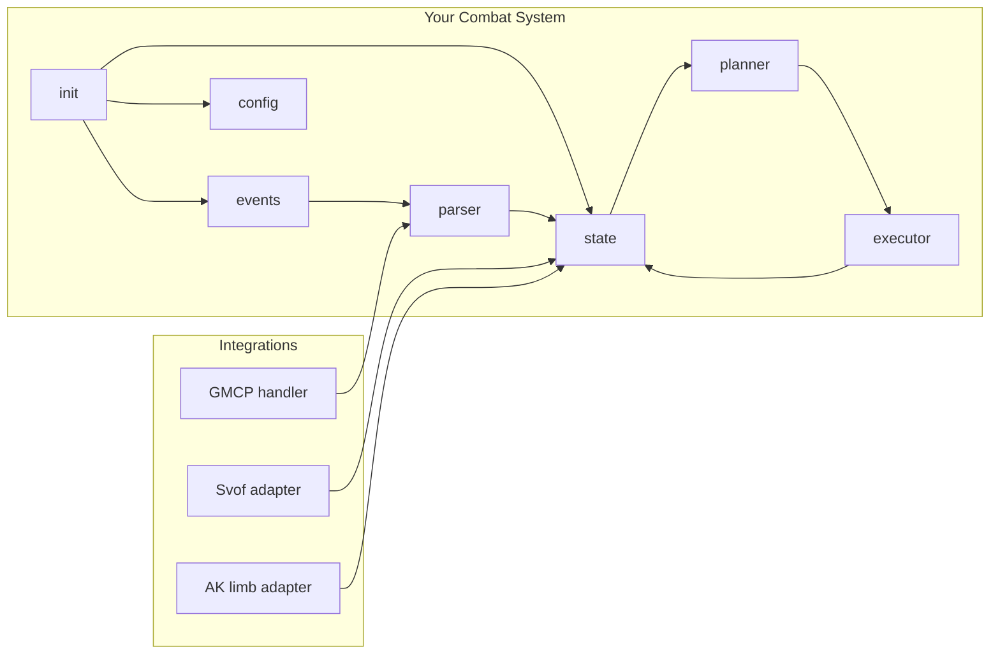

```markdown
# Achaea Mudlet Lua Scripting Best Practices for Automated Combat Systems (Runewarden Dual-Scimitar + Silver Dragon)

## Prioritized sources consulted

### Achaea official + AchaeaWiki
- Achaea combat fundamentals (balance/equilibrium throttling, “give-and-take” curing cadence, and explicit warning about illegal automation for gold/xp automation). citeturn1search5turn0search0
- AchaeaWiki curing reference table (affliction → cure action + herb/salve/smoke/sip mapping, including limb curing entries). citeturn0search4
- AchaeaWiki limb damage overview (mending vs restoration for different limb states). citeturn4view2
- Achaea Help Files index (official help system landing page; use in-game `HELP` as canonical for policies). citeturn1search6turn7search1

### Svof official docs + GitHub
- Svof documentation site (keepup/defup concepts; commands such as `vshow defup`, `vshow keepup`, `vdefup`, `vkeep`, `vcreate defmode`). citeturn0search1turn0search13turn0search5
- Svof GitHub repo (installation/development notes; Mudlet + Lua file split; using “sync” modules; “Save Profile” workflow). citeturn0search2turn0search14turn0search22
- Svof release notes (example of preferring GMCP over older approaches like `QL` for room content). citeturn0search10

### Mudlet official docs + repository
- Mudlet GMCP and protocol handling (GMCP storage in global `gmcp`, event handlers, `sendGMCP`). citeturn3search4turn3search10
- Mudlet ID/timer/event best practices (IDManager; avoiding duplicated timers/handlers). citeturn3search0turn11search4turn11search1
- Mudlet scripting and trigger engine references (`matches` table, trigger testing with `feedTriggers`, avoiding `expandAlias` in favor of functions). citeturn3search1turn11search0turn11search2turn3search24
- Mudlet package distribution + installation (`Package Manager`, mpkg repository/site, and Mudlet package manager announcement). citeturn10search3turn10search6turn10search9turn10search16
- Mudlet variable persistence via `table.save`/`table.load`. citeturn11search21

### IRE/Mudlet resources relevant to IRE games
- Iron Realms GMCP module list reference (modules like Char.Afflictions, Char.Defences, Char.Items, Char.Skills, etc.). citeturn3search10
- Open source IRE Mudlet UI patterns (GMCP namespace and dispatch approach). citeturn3search13

### Community sources (useful, but treat as secondary)
- Achaea forum community interpretations of automation boundaries (helpful for “what gets people in trouble,” but **not a substitute** for in-game HELP/policy). citeturn2search5turn1search1turn7search2

## Executive summary

You are building an automated PvP combat system in Mudlet Lua for Achaea that must combine three hard problems: (1) fast and correct **state tracking** (afflictions, limb damage, defences), (2) safe and legal **automation boundaries**, and (3) a reliable **command execution pipeline** gated by balance/equilibrium and cure cooldowns. Achaea combat is intentionally “give-and-take”: afflictions can be applied quickly, many herb/salve cures can be used around once per second, and health elixirs are commonly slower (about once per 5 seconds), so your scripting needs accurate timers, priorities, and anti-spam guarantees. citeturn1search5turn0search0

For best results, do not reinvent Svof’s curing/defence engine: integrate it via a clean adapter layer, operating in “read-only” mode by default. Svof already provides configurable defence lists (defup/keepup) and a mature curing model. citeturn0search1turn0search13turn0search5  
Build your own system as a higher-level “combat brain” that:
- reads state from Svof + GMCP + targeted text triggers,
- maintains a consistent internal state model (including limb estimates),
- chooses the next action via a planner,
- executes actions through a safe, rate-limited command executor (with bal/eq gating and a kill switch).

Use GMCP when available because it provides structured data and reduces brittle regex parsing; Mudlet stores GMCP payloads in the global `gmcp` table and raises events you can subscribe to. citeturn3search4turn3search10  
But assumes GMCP availability is **unspecified** (see “Assumptions”), so implement robust fallbacks to text parsing.

## Legal and ethical automation rules for Achaea

### Hard rule: combat scripting is allowed; unattended resource automation is not
Achaea explicitly notes that triggers are fine in combat, but it is against the rules to automate actions that generate resources like gold or experience (or similar “leave the keyboard and it keeps going” behavior). citeturn1search5turn0search0turn7search2

### Practical compliance guidance for combat automation
Treat the following as **required design constraints** for your combat system:

- Ensure the system is **reactive and bounded**: it should respond to stimuli in combat (incoming affs, balance/eq recovery, target behaviour), not run indefinite loops. Achaea’s own combat overview warns against automation for resource generation and provides the general framing that combat systems are collections of triggers/macros. citeturn1search5turn0search0  
- Add a global “panic stop” alias (e.g., `rwda stop`) that immediately disables sending combat commands and clears queued actions.
- Require explicit user intent for starting combat loops (e.g., pressing a keybind or running `rwda engage <target>`). Do not auto-attack based solely on seeing an enemy line in the room; that’s an easy way to become “unattended” or to misfire on illusions.

### Canonical policy source
Where policy specifics matter, the canonical source is the **in-game HELP system** (e.g., `HELP AUTOMATION`). Achaea hosts an online copy of help file structure, but some individual helps may not be easily linkable; rely on in-game `HELP` for the definitive wording. citeturn1search6turn7search1

## Mudlet environment setup

### Recommended baseline: Mudlet + GMCP + debugging
- Enable GMCP in Mudlet and use the debug window to observe inbound GMCP messages; Mudlet stores GMCP data in the `gmcp` global table (e.g., `gmcp.Char.Vitals`, `gmcp.Room.Info`) and you attach handlers that fire when a message arrives. citeturn3search4turn3search21
- For IRE games (including Achaea), GMCP modules include Char.Afflictions, Char.Defences, Char.Items, Char.Skills, Room, Comm.Channel, and more. citeturn3search10

### Mudlet version capabilities to leverage
- Mudlet’s **IDManager** (Mudlet 4.14+) exists specifically to solve common issues with forgotten timer/event handler IDs and duplicated handlers. Incorporate it early to avoid subtle bugs. citeturn3search0turn11search4
- If you distribute via mpkg, it comes preinstalled in later Mudlet versions (Mudlet 4.20+ per Mudlet package repository docs). citeturn10search6turn10search9

### Persistence and profile data
Persist configuration and “learned” state (venom sets, preferred strategies, aliases) using `table.save()`/`table.load()` into your Mudlet home/profile directory (`getMudletHomeDir()`). citeturn11search21

## Lua coding conventions for Mudlet combat systems

### Core principles
Prefer “game engine style” modularity: immutable-ish data tables + a state object + an event bus + pure(ish) decision logic + a side-effect executor.

Avoid calling aliases from triggers: Mudlet documentation warns `expandAlias()` is not very robust; the recommended approach is to implement core logic as Lua functions and call them from aliases/triggers/scripts directly. citeturn11search0turn11search2

### Suggested module layout
Use a predictable layout that Codex can generate and you can maintain:

| Area | Example files | Responsibility |
|---|---|---|
| Bootstrap | `rwda/init.lua` | Load order, integration detection, registering handlers |
| Config | `rwda/config.lua`, `rwda/config_schema.lua` | User settings, defaults, validation |
| Data | `rwda/data/afflictions.lua`, `rwda/data/defences.lua`, `rwda/data/abilities.lua`, `rwda/data/venoms.lua` | Pure tables, no side-effects |
| State | `rwda/state/me.lua`, `rwda/state/target.lua`, `rwda/state/cooldowns.lua` | Canonical state model + derived helpers |
| Engine | `rwda/engine/events.lua`, `rwda/engine/parser.lua`, `rwda/engine/planner.lua`, `rwda/engine/executor.lua` | Event flow, parsing, decisioning, sending |
| Integrations | `rwda/integrations/svof.lua`, `rwda/integrations/aklimb.lua` | Adapt external systems |
| UI | `rwda/ui/commands.lua`, `rwda/ui/status_window.lua` | Aliases, toggles, debug panels |

### Event bus and state updates
Mudlet already has an event system (including custom events), and many mature packages use an internal event bus layered on top.

Patterns to follow:
- Normalize inputs (GMCP message, line trigger, prompt) into a small set of internal events: `AFF_GAINED`, `DEF_GAINED`, `BAL_GAINED`, `LIMB_BROKEN`, etc.
- Use **named handlers** and store handler IDs to avoid duplicates. Mudlet’s IDManager exists because “duplicated event handlers” are a common failure mode when people forget to kill old handlers. citeturn3search0turn11search4

### Timers: never “sleep”; schedule
Mudlet timers are asynchronous; `tempTimer` schedules work later but does not pause the current script. Mudlet’s migration guide highlights this difference explicitly. citeturn11search9  
Therefore:
- Never write code that assumes a timer blocks execution.
- For “cooldowns,” always store timestamps and calculate remaining time.

Refresh timers safely by killing old timers before creating new ones (Mudlet shows this pattern to avoid multiple copies). citeturn11search1turn11search3

### Safe command executor (mandatory)
Implement a single pipeline for all outbound commands:
1. Planner outputs an “Action” object (commands + requirements).
2. Executor checks gates (bal/eq, cure channel locks, anti-spam).
3. Executor emits commands via `send()` (or queued sends).
4. Executor logs what it sent and why.

Mudlet can also intercept outgoing commands using the `sysDataSendRequest` event and `denyCurrentSend()` to block unwanted sends (useful for a global “safety valve”). citeturn3search1turn10search0

## Trigger and alias design patterns

### Design goals
- Minimize trigger count and complexity.
- Normalize variants into one handler (avoid copy/paste forests).
- Ensure every trigger handler is fast; heavy work belongs in planner tick.

### Recommended patterns
Use a three-tier trigger strategy:

1) **High-confidence, low-noise triggers**  
Examples: “You have recovered balance.”, “You may drink another health elixir.”, “A shimmering shield surrounds …”  
These update state directly.

2) **Lumped parsing triggers**  
Capture semi-structured lines (combat hits, limb damage text) and parse in Lua.

3) **Catch-all “prompt tick”**  
On each prompt, run:
- state synchronization (GMCP read, Svof snapshot, decay confidence)
- planner tick attempt (if enabled and gates allow)

### Alias patterns
- `rwda on/off`
- `rwda mode human|dragon|auto`
- `rwda target <name>`
- `rwda profile duel|group|raiding`
- `rwda debug on|off`
- `rwda stop` (panic kill switch)

Mudlet’s manuals emphasize that scripts can be used in aliases/triggers/timers and reused via functions, which is the maintainable approach. citeturn11search19turn11search2

## Parser and regex best practices

### Prefer events/GMCP > regex when possible
GMCP reduces brittle parsing and works even when normal server output is affected by pagers or formatting; Mudlet explicitly supports GMCP and documents handlers and storage structure. citeturn3search4turn3search10

### When using regex, anchor and constrain
Use:
- `^` and `$` anchors when appropriate
- non-greedy captures
- named captures where supported/usable
- strict word boundaries (`\b`) for aff names that are substrings of other words

### Understand Mudlet capture tables
Mudlet uses the `matches` table for regex captures; documentation shows `matches[2]` as the first capture group, etc. citeturn3search24

### Test triggers without needing live combat
Mudlet provides `feedTriggers(text)` for testing trigger logic by injecting fake lines into the trigger engine. citeturn3search1turn3search9  
Build a log replay harness on top of this (see Testing section).

## GMCP usage and robust fallbacks

### What GMCP can give you (IRE reference)
The Iron Realms GMCP documentation lists modules including:
- `Char` (character info), `Char.Afflictions`, `Char.Defences`, `Char.Items`, `Char.Skills`
- `Room` (room data)
- `Comm.Channel` (channels/player lists)
- `IRE.Rift`, and others citeturn3search10

### Mudlet’s GMCP mechanics
- Data is stored “as received” in `gmcp.<Package>.<Message>` (e.g., `gmcp.Char.Vitals`, `gmcp.Room.Info`). citeturn3search4
- You attach event handlers to fire on GMCP messages; Mudlet shows this as the primary way to “trigger” on GMCP. citeturn3search4turn3search21
- Some modules need a request from the client, sent via `sendGMCP("...")`. citeturn3search4

### Fallback design (assumption: GMCP availability unspecified)
In Achaea, GMCP is commonly available, but treat it as “optional” in your system:
- If GMCP data present: treat as authoritative.
- If absent: revert to prompt parsing (`PROMPT STATS`, custom prompt tags) and text triggers.
- Keep a “data provenance” flag per field: `source = gmcp|svof|text|guess`.

## Integration patterns with Svof and AK limb tracker

### Svof integration: detect, adapt, and avoid fights
Svof provides curing + defence raising and exposes user-facing configuration for defence lists:
- `vshow defup` / `vshow keepup`
- `vdefup <defence>` / `vkeep <defence>`
- `vcreate defmode <name>` citeturn0search1turn0search13turn0search5

Svof’s README emphasizes that code changes come from Mudlet items and Lua files; editing Mudlet triggers/aliases/scripts should be followed by “Save Profile,” and using module sync means changes write back to XML automatically. citeturn0search2turn0search14turn0search22

#### Recommended integration modes
1) **Read-only mode (default)**
- Read Svof’s state snapshots (affs, defs, balances, cure locks).
- Do not send cure commands yourself.
- Your planner/offense uses Svof facts.

2) **Control mode (advanced, optional)**
- You may toggle Svof configuration via its commands (e.g., set a defmode before dragonform, alter keepup list).
- Still avoid directly curing unless you fully disable Svof curing.

#### Adapter guidelines
- Detect Svof by checking known global tables or by features (e.g., existence of `vshow` alias patterns is not reliable; prefer Lua globals if available).
- Mirror into your canonical `State` object:
  - `State.me.affs` from Svof aff table
  - `State.me.defs` from Svof def table
  - `State.cooldowns` from Svof cure timers if accessible
- Add a “lock” to prevent double-sending:
  - If Svof will cure herb/salve/sip, your executor must not also cure.

#### Prefer GMCP where possible
Svof release notes show ongoing improvements like using GMCP instead of older methods (e.g., `QL`) for room content, which reinforces the general preference for structured data when available. citeturn0search10

### AK limb tracker integration (supplied resource status)
You indicated you have AK Limb Tracker and group combat scripts “supplied.” In this chat environment, some uploaded files appear to have expired before they could be inspected directly, so the patterns below are written as **generic adapters** until the package APIs are verified. (Re-uploading those packages later would allow a precise integration guide.)

#### Adapter pattern for any limb system
- Wrap external limb data into your internal canonical structure:
  - `State.target.limbs[limb].damage_pct`
  - `broken` / `mangled`
  - confidence + last_updated timestamps
- Expose two functions:
  - `aklimb.pull(target)` → returns the latest limb table estimate
  - `aklimb.push(event)` → lets your parser update the limb system (optional)

## Affliction, limb, and defence data modeling

### Afflictions
Use the AchaeaWiki curing table as a base mapping: affliction → cure method (eat/apply/smoke/sip/writhe) plus the herb/salve name. citeturn0search4

Model each affliction as a record with:
- `id` (canonical; lowercase)
- `cure`: `{channel="herb|salve|smoke|sip|special", item="bloodroot|restoration|valerian|..." }`
- `blocks`: list of blocked actions (e.g. anorexia blocks eat/drink; slickness blocks apply) (encode in your own schema even if sourced from broader knowledge—confirm in HELP or wiki pages when needed)
- `priority`: curing importance (Svof handles this; your model is for reasoning + offense logic)

### Limb damage
Achaea distinguishes limb damage cure types:
- **Crippled/broken limb** → cured by **mending** salve.
- **Damaged/mangled limb** → cured by **restoration** salve. citeturn4view2turn0search4

Your limb model should separate:
- `damage_estimate` (0–100+)
- `state` enum: `ok|damaged|mangled|broken|crippled` (map to cure types)
- `cure_needed`: `restoration|mending|none`

### Defences
Track:
- `shield` and `rebounding` as high-priority “must handle before weapon hits” defences in your offense planner.
- Use confidence decay because many defences are lost upon aggression/movement and you may not parse the exact removal line every time (especially in hectic logs).

## Curing/defence interaction rules

### Rate/cadence implications
Achaea combat is built around throttling both attacks and healing: balance/equilibrium throttle actions; cure intervals vary by cure type; many aff cures can be used about once per second while health elixirs are slower (~5 seconds). citeturn1search5turn0search0

### Practical system rule
Your executor should maintain distinct “channels”:
- `herb`, `salve`, `smoke`, `sip_health`, `sip_mana`, `focus`, `writhe`, `special`
to avoid illegal/ineffective command spam and to plan around cure windows.

If Svof is handling cures, your system should treat those channels as **owned by Svof** and only request strategic actions outside those (e.g., form swap, offense, movement control).

## Rate-limiting, bal/eq gating, and anti-spam

### Bal/eq gating must be explicit
Achaea’s combat overview emphasizes balance and equilibrium as core action limiters; offensive actions typically require both. citeturn1search5turn0search0  
Therefore your executor must:
- refuse to send balance actions if `State.me.bal == false`
- refuse to send equilibrium actions if `State.me.eq == false`
- optionally queue exactly one “next action” per channel (avoid deep queues that go stale)

### Anti-spam requirements
- One “decision tick” per prompt (or per GMCP vitals update) is usually enough.
- Explicitly de-duplicate commands: if you already sent the same command within N milliseconds and no state changed, do not send again.
- Use Mudlet’s `sysDataSendRequest` + `denyCurrentSend()` as a final safety net to block commands during `rwda stop` mode. citeturn3search1turn10search0

### Use IDManager + proper handler cleanup
Duplicated timers and duplicate event handlers are a top cause of “why is my system firing twice.” Mudlet created IDManager because this is repeatedly forgotten. citeturn3search0turn11search4

## Testing strategies

### Log replay harness (recommended)
Use `feedTriggers()` to replay saved combat logs line-by-line through your trigger engine to validate parsing and state transitions without needing live fights. citeturn3search1turn3search9

Minimal harness features:
- load a log file into Lua (line array)
- feed each line with `feedTriggers(line .. "\n")`
- after each prompt line, call your planner “tick”
- assert expected state outcomes (aff gained, limb broken, def stripped)

### Unit tests (Lua-level)
Mudlet is not a full test runner environment, but you can:
- build a thin assertion library (`assertEq`, `assertTrue`)
- run tests from an alias (`rwda test parser`)

### Acceptance tests (in-game)
Create deterministic checklists:
- “When盾 appears, system razes instead of DSL.”
- “When GMCP says balance recovered, system sends exactly one queued attack.”
- “When `rwda stop` is enabled, no commands are sent even if triggers fire.”

## Deployment: package (.mpackage) structure and release workflow

### Package distribution options
- Mudlet has a built-in Package Manager for importing/exporting packages (collections of scripts you can share). citeturn10search3
- Mudlet supports a package repository + **mpkg** CLI, intended to install/update packages; mpkg is described in Mudlet’s package repository documentation and site. citeturn10search6turn10search9turn10search16

### Development workflow with version control
Svof and Mudlet community workflows commonly use Mudlet’s Module Manager with “sync” modules so that edits in Mudlet write back to XML, enabling version control. citeturn0search2turn10search2turn10search5  
This is the recommended approach if you plan to collaborate or maintain multiple profiles.

### Deployment checklist
- Package contains:
  - scripts
  - aliases
  - triggers
  - any required UI windows
  - documentation (README inside package)
- Provide:
  - installer notes (Mudlet version, dependencies, Svof optional)
  - upgrade notes (how to preserve config; migrate old keys)

## Templates and example snippets for Codex

> Notes:
> - These are **templates**; adapt command syntax to your exact Achaea prompt/alias conventions.
> - Do not embed citations inside code fences (Codex-friendly).

### Example: `rwda/config.lua` (template)
```lua
rwda = rwda or {}

rwda.config = {
  enabled = false,

  integration = {
    use_svof = true,         -- read-only by default
    svof_control_mode = false,
    use_aklimb = true,       -- adapter-based
  },

  gmcp = {
    enabled = true,          -- assume available; fallback if missing
  },

  combat = {
    mode = "auto",           -- "auto"|"human"|"dragon"
    target = nil,
    send_echo = false,
    anti_spam_ms = 250,
  },

  weapons = {
    mainhand = "scimitar",
    offhand  = "scimitar",
  },

  runewarden = {
    default_goal = "limbprep",  -- "pressure"|"limbprep"|"impale_kill"
    venoms = {
      -- ordered as applied, but delivery is last-on-first-off for envenom stacks
      dsl_main = {"curare", "gecko"},
      dsl_off  = {"epteth", "kalmia"},
    },
  },

  dragon = {
    breath_type = "lightning", -- Silver breath type (confirm exact in-game token)
    default_goal = "devour",
  },
}
```

### Example: `rwda/data/afflictions.lua` (minimal seed from wiki curing table)
```lua
rwda = rwda or {}
rwda.data = rwda.data or {}

rwda.data.afflictions = {
  paralysis = { cure = {channel="herb", item="bloodroot"}, priority=80 },
  epilepsy  = { cure = {channel="herb", item="goldenseal"}, priority=70 },
  impatience= { cure = {channel="herb", item="goldenseal"}, priority=60, blocks={"focus"} },
  anorexia  = { cure = {channel="salve", item="epidermal"}, priority=95, blocks={"eat","sip"} },
  slickness = { cure = {channel="herb", item="bloodroot"}, alt={{channel="smoke", item="valerian"}}, priority=90, blocks={"apply"} },

  -- limb “afflictions” (track separately but keep cure info nearby)
  crippled_limb = { cure = {channel="salve", item="mending"}, priority=99 },
  mangled_limb  = { cure = {channel="salve", item="restoration"}, priority=99 },
}
```
Source mapping reference: AchaeaWiki Curing table. citeturn0search4

### Example: `rwda/data/abilities.lua` (ability metadata)
```lua
rwda.data.abilities = {
  -- Human dual cutting
  raze = { costs={bal=true, eq=true}, type="offense", strips={"shield","rebounding"} },
  dsl  = { costs={bal=true, eq=true}, type="offense", delivers_venoms=true, limb_target=true },

  -- Dragoncraft
  summon_breath  = { costs={eq=true}, type="setup" },
  breathstrip    = { costs={eq=true}, type="offense", strips={"defences"} },
  blast          = { costs={eq=true}, type="offense" },
  rend           = { costs={bal=true, eq=true}, type="offense", limb_target=true },
  devour         = { costs={bal=true, eq=true}, type="finisher" },
  dragonheal     = { costs={eq=true}, type="heal" },
}
```

### Example: planner pseudocode (Codex should implement in `planner.lua`)
```lua
function rwda.planner.choose(state)
  if not rwda.config.enabled or not state.target.name then return nil end

  -- 1) Mode resolution
  local mode = rwda.resolveMode(state) -- auto/human/dragon

  -- 2) Defensive handling (target)
  if mode == "human" then
    if state.target.defs.rebounding then
      return Action({"raze " .. state.target.name .. " rebounding"}, "strip rebounding")
    end
    if state.target.defs.shield then
      return Action({"razeslash " .. state.target.name}, "strip shield while pressuring")
    end
  end

  if mode == "dragon" then
    if not state.me.dragon.breath_summoned then
      return Action({"summon " .. rwda.config.dragon.breath_type}, "enable breath")
    end
    if state.target.defs.shield then
      return Action({"tailsmash " .. state.target.name}, "break shield")
    end
    return Action({"breathstrip " .. state.target.name}, "strip defences")
  end

  -- 3) Primary offensive goal (limbprep, pressure, kill routes)
  return rwda.runGoalLogic(mode, state)
end
```

## Tables: recommended canonical data structures

### State model comparison
| Subsystem | Minimal fields | Notes |
|---|---|---|
| `State.me` | `hp`, `mp`, `bal`, `eq`, `affs{}`, `defs{}`, `form`, `cooldowns{}` | `bal/eq` gating is fundamental to Achaea combat. citeturn1search5turn0search0 |
| `State.target` | `name`, `affs{}`, `defs{}`, `limbs{}`, `position{prone}` | Use confidence + timestamps for uncertain info |
| `State.cooldowns` | `herb_ready_at`, `salve_ready_at`, etc. | Mirror Svof if integrated; otherwise timers |
| `State.integration` | `svof_present`, `ak_present`, `gmcp_present` | Drives adapters |

### Module relationship table
| Module | Depends on | Provides |
|---|---|---|
| `parser` | `events`, `state`, optionally `gmcp` | Turns raw text/GMCP into events |
| `planner` | `state`, `data/*` | Picks “next action” |
| `executor` | `state`, Mudlet `send()`, safety | Sends commands; anti-spam; kill switch |
| `integrations/svof` | Svof runtime globals | Read-only snapshot or control commands |
| `integrations/aklimb` | AK limb APIs | Limb estimates |

### Command template table (customize per your syntax)
| Context | Template | Use when |
|---|---|---|
| Human defence strip | `raze <tgt> shield` / `razeslash <tgt>` | Shield/rebounding present |
| Human limb pressure | `dsl <tgt> <limb> <venom1> <venom2>` | Limb prep/break route |
| Dragon breath prep | `summon <breath>` | Breath not active |
| Dragon defence strip | `breathstrip <tgt>` | Need to remove defences |
| Dragon shield break | `tailsmash <tgt>` | Shield present citeturn0search16turn3search10 |

## Mermaid diagrams (event flow + module relationships)

### Event flow: input → normalize → plan → execute
```mermaid
flowchart TD
  A[Server output lines] --> B[Text triggers]
  A --> C[Prompt trigger]
  D[GMCP messages] --> E[GMCP handlers]

  B --> F[Parser normalize]
  C --> F
  E --> F

  F --> G[State update]
  G --> H[Planner tick]
  H --> I{Gates OK?\n(bal/eq, anti-spam)}
  I -->|No| J[Queue or wait]
  I -->|Yes| K[Executor send()]
  K --> L[send() to server]
  K --> M[Debug log + telemetry]
```

### Module relationships: RWDA + integrations


## Codex-friendly implementation checklist

### Foundation
- [ ] Create `rwda/` module tree and loader in `init.lua`.
- [ ] Implement logging utility with levels.
- [ ] Implement global kill switch alias (`rwda stop`) that blocks sends.

### State + events
- [ ] Define canonical `State` object (me/target/cooldowns/integration).
- [ ] Create internal event bus (subscribe/emit).
- [ ] Implement handler ID management (use IDManager if available). citeturn11search4

### GMCP first
- [ ] Add GMCP handlers for vitals/affs/defs if present; store in `State`.
- [ ] Confirm GMCP module names using IRE reference list. citeturn3search10
- [ ] Add fallback prompt parsing if GMCP missing.

### Parsers and triggers
- [ ] Build minimal, high-confidence triggers for: bal regain/loss, eq regain/loss, shield/rebounding seen/lost.
- [ ] Add optional “combat hit parsing” triggers for limb tracking.
- [ ] Create a log replay harness using `feedTriggers()` to validate parsing. citeturn3search1turn3search9

### Svof integration
- [ ] Detect Svof presence.
- [ ] Implement read-only state mirror from Svof.
- [ ] Ensure no duplicate curing commands are sent.
- [ ] (Optional) implement control mode toggles for defup/keepup via documented commands. citeturn0search1turn0search13

### Planning + execution
- [ ] Implement planner (human dualcut + dragon silver) as deterministic rules first.
- [ ] Implement executor with:
  - bal/eq gating
  - channel cooldown gating
  - anti-spam window
  - dedupe logic
- [ ] Add `sysDataSendRequest` safety net to deny sends when stopped. citeturn3search1turn10search0

### Packaging + deployment
- [ ] Build as `.mpackage` exportable via Mudlet Package Manager. citeturn10search3
- [ ] Provide README with:
  - install steps
  - Mudlet version guidance
  - Svof integration modes
  - configuration examples
- [ ] Optionally publish/maintain using mpkg workflows (Mudlet package repository). citeturn10search6turn10search9

## Assumptions and gaps

- **GMCP availability**: unspecified. This guide assumes GMCP is often available in IRE games and is supported by Mudlet, but your system must run without GMCP using prompt/text parsing fallbacks. citeturn3search4turn3search10
- **AK limb tracker and group scripts**: referenced as supplied, but could not be inspected directly here due to upload expiry. The integration guidance is therefore adapter-based and API-agnostic until those package internals are confirmed.
- **Policy**: the most authoritative automation boundaries come from in-game help files (e.g., `HELP AUTOMATION`). Online sources and forum posts should be treated as secondary confirmation, not canon. citeturn1search6turn7search1turn7search2
```