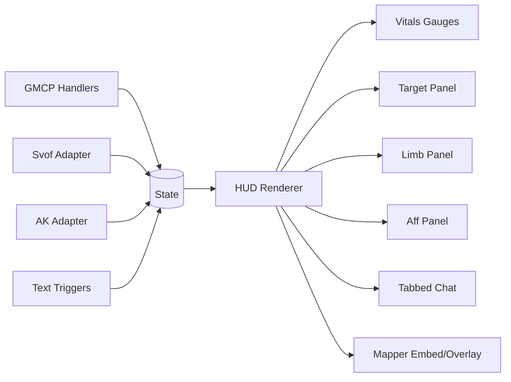
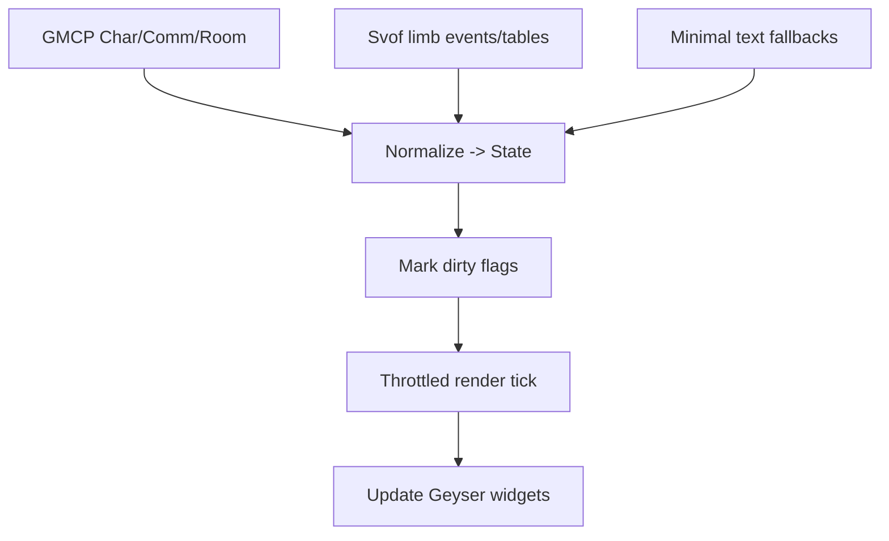

```markdown
# Achaea Mudlet Combat HUD GUI Guidelines (Lua, Geyser, GMCP, Svof Integration)

## Prioritized sources
Primary/official (requested order):
- Achaea Help Files index (online mirror of in-game HELP structure; policies are canonical in HELP). citeturn29view0
- AchaeaWiki combat automation boundaries + balance/eq and cure cadence. citeturn15view0turn15view2
- AchaeaWiki curing reference table (affliction→cure mapping, including limb cure entries). citeturn14view3
- Svof documentation (limb counters + API/events; defup/keepup notes; do/dofree queues; ignore list naming). citeturn22view0turn22view1turn22view3turn27search4
- Svof GitHub repo (feature overview; use as reference for integration expectations). citeturn21search0

Additional high-quality sources (post-priority):
- Mudlet UI API (miniconsole/label/gauge creation; resize/persistence helpers). citeturn23view3turn23view0turn23view2
- Mudlet Geyser reference (MiniConsole/Label/Gauge/UserWindow/Mapper primitives). citeturn9view0turn10view0turn10view3turn10view4turn10view5
- Mudlet IDManager (named timers/handlers; prevents duplicated handlers). citeturn25view0
- Mudlet Mapper API (openMapWidget, registerMapInfo, map labels/images, map context menu events, room user data). citeturn11view0turn11view3turn13view0turn13view2turn11view1
- IRE GMCP spec (Char.Vitals/Afflictions/Defences; Comm.Channel for chat; Redirect.Window). citeturn15view6turn15view7turn15view5turn16view1

AK/Achaea Knight resources:
- Some user-supplied AK/KNight files may be expired/unavailable in this workspace; integration guidance below uses adapter patterns until those packages are re-uploaded and inspected.

## Executive summary
Build the HUD as a “read-only, event-driven view” over your combat state: a canonical `State` table is updated from GMCP + Svof + minimal text triggers, and the GUI re-renders only on meaningful deltas. Prefer Geyser components (Gauge/Label/MiniConsole/UserWindow/Mapper) for layout and styling and use Mudlet’s IDManager to avoid duplicate timers/handlers. citeturn6search1turn25view0turn8view0  
For chat tabs, prefer IRE GMCP `Comm.Channel.*` messages to avoid brittle regex routing, and store per-channel toggles/mutes in persistent config. citeturn15view5turn24search7  
For limb panels and prep indicators, leverage Svof limb counter APIs (`svo.dl_list` / events) when present; otherwise fall back to your own limb model and parsing. citeturn22view0turn22view1  

## Compliance and automation boundaries
Achaea allows triggers/systems for combat, but explicitly warns it is against the rules to use triggers to automate actions that generate resources like gold or experience. citeturn15view0  
Treat policy as “HELP is canonical”: the Achaea help site is a copy of the in-game help structure, and in-game `HELP` shows the same menu; rely on in-game HELP for definitive rule text and updates. citeturn29view0  

HUD-specific compliance guidance:
- Keep the HUD passive: display state and provide optional click-to-fill command line actions, but avoid unattended loops.
- Provide a global “UI safe mode” toggle that disables clickable action sending; the HUD must continue to function as display-only.

Assumption: GMCP availability is unspecified; design for GMCP-first with text parsing fallback.

## HUD UX and component specs
### UX requirements and wireframe descriptions
Aesthetic: clean medieval UI with blues/purples; minimal clutter; consistent spacing; readable fonts; clear “danger” accents.

Suggested layout (top-level):
- Left column: **Vitals + balances + form + defenses summary**
- Center: main Achaea text console (unchanged)
- Right column: **Target panel**, **Limb panel**, **Affliction panel**, **Execute/ability window**
- Bottom dock: **Tabbed chat pane** (with per-channel toggles), optional compact **combat log** pane
- Mapper: either embedded in right/bottom region or popped out, with HUD “anchors” tied to mapper events.

Wireframe (conceptual):
```
[ Vitals/Bal/EQ/Form ]  |   Main Console   | [ Target ]
[ Defs summary ]        |                 | [ Limbs  ]
[ Optional stats ]      |                 | [ Affs   ]
------------------------+-----------------+-----------
[ Chat Tabs: ct gt pt tells newbie market ... ] [Mapper]
```

### GUI component table
| Component | Purpose | Data sources | Update trigger | Interaction |
|---|---|---|---|---|
| Vitals bar | HP/MP/EP/WP + bleed/rage + balances | GMCP `Char.Vitals` | GMCP vitals event | Tooltips; low threshold warning |
| Target panel | current target, hp% estimate, key defs, prone/webbed etc | GMCP (if available) + Svof state + text | prompt tick + def/aff events | Click: set target / assist |
| Limb panel | limb damage + break/prep + restoration/mending states | Svof limb counter tables/events or custom limb model | limb hit/break events | Click: set limb focus (planner hint) |
| Affliction panel | own affs + key blockers + “priority now” | GMCP `Char.Afflictions.*` + Svof | aff add/remove events | Hover: cure hint; click-to-copy cure |
| Defences panel | own defs keepup/defup status | GMCP `Char.Defences.*` + Svof | def add/remove + Svof snapshot | Toggle “show only missing” |
| Ability/execute window | shows available routes + cooldowns + gating | your combat engine + bal/eq + cure locks | prompt tick | Click: queue a suggested action (optional) |
| Chat pane tabs | per-channel logs + toggles/mute | GMCP `Comm.Channel.*` preferred | channel text events | Toggle: mute/highlight; per-tab badge counts |
| Mapper integration | embed/popup map; show overlays and context actions | Mudlet mapper APIs + Svof people tracker patterns | room change + map events | Right-click map menu actions |

## Canonical data model and integration architecture
### Canonical state tables
Use one canonical `State` that the HUD reads, regardless of source. Example schema:
```lua
State = {
  me = {
    vitals = { hp=0, maxhp=0, mp=0, maxmp=0, ep=0, maxep=0, wp=0, maxwp=0 },
    balances = { bal=false, eq=false, balLeft=0, eqLeft=0 },
    form = "human", -- or "dragon"
    affs = {}, defs = {},
    cooldowns = { herbReadyAt=0, salveReadyAt=0, sipReadyAt=0, focusReadyAt=0 },
  },
  target = {
    name=nil,
    status = { prone=false, webbed=false, shield=false, rebounding=false },
    affs = {}, defs = {},
    limbs = { head=0, torso=0, la=0, ra=0, ll=0, rl=0, breakAt=nil, confidence=0 },
  },
  chat = { tabs = {}, unread = {}, muted = {} },
  mapper = { roomId=nil, area=nil },
  integration = { gmcp=false, svof=false, ak=false },
}
```

### GMCP mapping requirements
- `Char.Vitals` provides hp/mp/ep/wp and a “string” field; keys are game-specific and may include Achaea-specific additions. citeturn15view6
- `Char.Afflictions.List/Add/Remove` provides structured affliction data including cure and desc. citeturn15view7
- `Char.Defences.List/Add/Remove` provides structured defense data. citeturn15view8
- `Comm.Channel.List/Start/Text/End` provides channel inventory and channel text routing metadata; use this for tabbed chat. citeturn15view5

Fallbacks when GMCP is missing:
- Parse prompt (bal/eq indicators) per Achaea’s PROMPT STATS mechanics. citeturn15view2
- Parse common aff/def gain/loss lines with minimal regex; do not attempt to replicate all GMCP richness if Svof already tracks it.

### Svof integration patterns
Default mode: read-only.
- Limb counters: Svof provides dragon and knight limb counters that track the last-hit opponent and expose tables like `svo.dl_list` and events like `svo limbcounter hit (who, where)`; the HUD should subscribe and render directly. citeturn22view0turn22view1
- Svof’s docs also show “prompt tag” integration (`@dl_prompttag`, `@kl_prompttag`)—use these as validation references but prefer HUD rendering over prompt clutter. citeturn22view0turn22view1
- Svof action queue concepts: `do`/`dofree` support actions that may require bal/eq but may not take it; surface these queue states as “planned action” chips in the ability window. citeturn22view3
- Defup/keepup: Svof supports `vshow defup` / `vshow keepup` and configuration via `vdefup`, `vkeep`, `vcreate defmode`; HUD can display the active mode but should not auto-change it unless “control mode” is explicitly enabled. citeturn27search4

AK integration (files may be unavailable):
- Implement an adapter API:
```lua
ak = {
  present = function() return _G.ak ~= nil end,
  getLimbs = function(target) return nil end, -- fill once AK API known
}
```

## Mudlet GUI implementation patterns for a combat HUD
### Choose the right UI primitives
Use Geyser as the main framework: it’s designed for creating/updating/organizing GUI elements and improving UI compatibility across screen sizes. citeturn6search1  

Recommended primitives:
- Text-heavy panes (chat, aff list): `Geyser.MiniConsole` (supports scrolling, wrap, buffer sizing, clickables). citeturn9view0
- Bars: `Geyser.Gauge:setValue(current, max, text)` plus stylesheet hooks; supports orientations and strict cap behavior. citeturn10view0
- Clickable toggles, borders, backgrounds: `Geyser.Label` (CSS/images; callbacks; tiled background image). citeturn10view2turn10view3
- Dockable windows: `Geyser.UserWindow` supports `docked`, `dockPosition`, and `restoreLayout` behaviors. citeturn10view4
- Embedded map: `Geyser.Mapper` represents a mapper primitive. citeturn10view5

If you must use raw Mudlet UI functions:
- `createMiniConsole()` is explicitly described as ideal for status screens and chat windows, but cannot have transparency; use labels behind it for backgrounds. citeturn23view3
- Persist floating window layout with `saveWindowLayout()` / `loadWindowLayout()`. citeturn23view0
- Handle resizing via `sysWindowResizeEvent` (the older `handleWindowResizeEvent()` is deprecated). citeturn23view2

### Event handlers and timers best practices
Use IDManager (Mudlet 4.14+) to prevent duplicated event handlers/timers and to manage them by name. citeturn25view0  
Use timers as schedulers, not blockers; store timer IDs (or named timers) and kill/replace prior timers when refreshing state. citeturn1search0turn25view0  

Render loop recommendation:
- Do not redraw UI on every incoming line.
- Instead, mark “dirty flags” (e.g., `dirty.vitals=true`) and run a throttled renderer at ~10 FPS or “next prompt”, whichever is slower.

### Chat pane with tabbed channels and toggles
GMCP-first approach:
- On login, consume `Comm.Channel.List` to build tab metadata (name, caption, command). citeturn15view5
- Route each `Comm.Channel.Text` to the correct tab buffer; increment unread counters if tab not active. citeturn15view5
- Optional: use `Comm.Channel.Start/End` for multi-line channel messages if your game sends them. citeturn15view5

Minimal tab implementation approach:
- Tabs are `Geyser.Label` buttons (with active CSS class applied).
- Each tab’s content is a `Geyser.MiniConsole` with `:setBufferSize()` and `:setWrap()`. citeturn9view0
- Per-channel toggles: maintain `State.chat.muted[channel]=true/false`, and skip printing when muted.

### Mapper integration specifics
Two supported approaches:
- Pop-out map widget: `openMapWidget()` (supports docking area or explicit geometry). citeturn11view0
- Embed map: use `Geyser.Mapper` inside your layout container. citeturn10view5

HUD overlay and hooks:
- Add custom map info lines (e.g., “Target: X | Prone: Y | Danger: Z”) using `registerMapInfo(label, callback)`; enable/disable with `enableMapInfo/disableMapInfo`. citeturn11view3
- Place map text labels near rooms with `createMapLabel()` and anchor to room coordinates via `getRoomCoordinates(getPlayerRoom())`. citeturn13view0
- Place icons/images with `createMapImageLabel()` for “raid markers” or “objective pins”. citeturn13view1
- Store map metadata per room with `setRoomUserData(roomId, key, value)` and retrieve with `getRoomUserData()`. citeturn13view2turn13view3
- Add right-click map actions using `addMapMenu()` + `addMapEvent()` that raises a Mudlet event with arguments (ideal for clickable “mark as safe/unsafe” workflows). citeturn11view1turn11view2

### Styling guidance and accessibility
Palette (example hex):
- Background: `#0b1020` (deep navy)
- Panels: `#111a33` (navy slate)
- Primary accent: `#5b6cff` (blue-violet)
- Secondary accent: `#9b6cff` (purple)
- Danger: `#ff5b6c`
- Warning: `#ffcc66`
- Success: `#5bffb0`
Typography:
- Use a readable serif for headings (medieval feel) and a crisp sans/mono for numbers.
Accessibility:
- Never rely on color alone for status; add icons/text (e.g., “EQ”/“BAL” glyphs), and provide optional high-contrast mode.
- Keep minimum font size readable; allow user scaling via config and `setMiniConsoleFontSize()` when using raw mini consoles. citeturn23view4

## Testing, performance, and deployment
### Performance and rate limiting
- UI updates: throttle; render only on state deltas.
- Chat buffers: cap lines per tab with MiniConsole buffer sizing to avoid memory bloat. citeturn9view0
- Avoid heavy imagery/animations; Mudlet notes GIFs are expensive (only relevant if you add animated effects). citeturn23view4

### Testing plan
- Unit tests (Lua): validate formatting functions, tab routing, and state diff logic.
- Log replay harness: feed saved logs to triggers using `feedTriggers()`; compare expected state transitions and GUI output (counts/badges). citeturn1search3
- UI acceptance tests:
  - Resizing window reflows layout (via `sysWindowResizeEvent` + Geyser reposition). citeturn23view2turn8view0
  - Switching tabs preserves buffer contents, unread counts reset when opened.
  - Mapper overlay shows correct target/room info and right-click actions fire.

### Deployment structure and install notes
Package as `.mpackage` with:
- `hud/` (gui components + theme)
- `state/` (canonical State + adapters)
- `integrations/` (gmcp, svof, ak)
- `tests/` (optional)
- `README.md` (install + config)

Include “connect-to-Achaea” note: Mudlet connects to `achaea.com` on port 23 or 2003 (per AchaeaWiki newbie guide). citeturn14view0  
Persist user settings with `table.save()`/`table.load()` to `getMudletHomeDir()`. citeturn24search7  

## Mermaid diagrams
### Module relationships


### Event flow


## Codex-friendly implementation checklist with milestones
Milestone: Foundations
- Acceptance: HUD loads without errors; `State` exists; integration detection flags set (gmcp/svof/ak).

Milestone: Vitals and balances
- Acceptance: HP/MP/EP/WP bars update from `Char.Vitals`; EQ/BAL indicators reflect Achaea gating model. citeturn15view2turn15view6

Milestone: Chat tabs
- Acceptance: Tabs auto-created from `Comm.Channel.List`; channel text routed to correct buffers; mute toggle works. citeturn15view5

Milestone: Limb + aff panels
- Acceptance: If Svof limb counter present, limb panel shows `svo.dl_list` for `svo.lasthit`; otherwise shows placeholders and can be updated by custom events. citeturn22view0  
- Acceptance: Aff panel renders GMCP aff list/add/remove when available. citeturn15view7

Milestone: Mapper integration
- Acceptance: Map opens/embeds; `registerMapInfo()` shows custom HUD line; right-click map menu triggers an event. citeturn11view0turn11view3turn11view1

Milestone: Persistence and resize
- Acceptance: Layout persists via `saveWindowLayout/loadWindowLayout`; resizing uses `sysWindowResizeEvent` (not deprecated handler). citeturn23view0turn23view2

Milestone: Performance + tests
- Acceptance: UI throttled; log replay harness using `feedTriggers()` can playback logs and update `State`/HUD deterministically. citeturn1search3
```