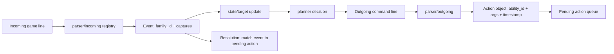
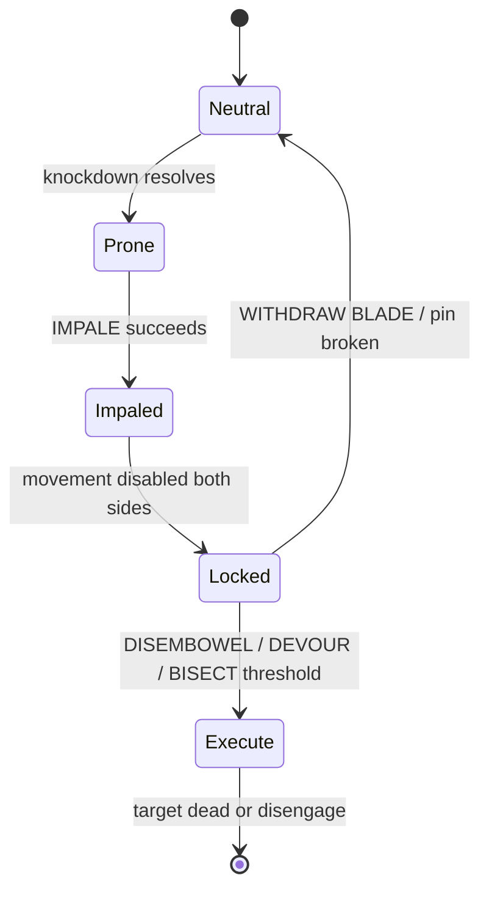

# Achaea PvP Combat I/O Research and Silverfury Integration Plan

[Download the Markdown report](sandbox:/mnt/data/Achaea_PvP_Silverfury_Report_v2026-03-06.md)  
[Download ability catalog CSV](sandbox:/mnt/data/achaea_pvp_ability_catalog_v2026-03-06.csv)  
[Download message families CSV](sandbox:/mnt/data/achaea_pvp_message_families_v2026-03-06.csv)  
[Download command→message→state mapping CSV](sandbox:/mnt/data/achaea_pvp_command_mapping_v2026-03-06.csv)

**Report date:** March 6, 2026 (America/New_York)  
**Data version label:** v2026-03-06  
**Primary scope:** PvP combat input (outgoing commands) and output (combat text lines) for Runewarden-related skills (**Weaponmastery**, **Runelore**, **Discipline**) and Greater Dragon (**Dragoncraft**), with **Battlerage** included mainly for context. citeturn41view0turn48view3turn49view0turn45view0turn4view3

## Executive summary

PvP parsing for Achaea is best treated as a **many-to-many mapping** between **outgoing commands** and **incoming “message families”**: a single outgoing command (e.g., a weapon attack) can yield hit variants, miss variants, parries, dodges, rebound/reflection interactions, and defence-breaking side effects, all of which must be interpreted to update combat state correctly. citeturn41view1turn43view1turn50view0turn27view0turn28view2

This report delivers a versioned dataset and an implementation design that is **data-driven** (CSV-backed), **registry-based** (regex family definitions + handlers), and **replay-tested** (log harness + unmatched-line capture). The dataset prioritizes official Achaea wiki ability definitions for Weaponmastery/Runelore/Discipline/Dragoncraft and uses open-source trigger patterns (notably the Svof limbcounters and trackers) to anchor regex-ready output text families that are historically stable and practically useful. citeturn41view0turn48view2turn49view1turn45view2turn27view0turn28view2

Recent official changes late 2025+ that should be treated as “version boundaries” for PvP behavior include: Weaponmastery **ARC** and **LUNGE** being dodgeable under the dexterity update, plus classlead adjustments to Runelore (**PITHAKHAN**, **KENA**) and Weaponmastery (**MASTERY**, **ASSAULT TORSO**) and a rework of warrior-tertiary **RAGE** behavior (notably affliction reapplication after ~3.5s). citeturn50view0turn51view0turn51view1

## Sources and current-state considerations

The Achaea wiki is used as the primary authority for **command syntax**, **targets**, **cooldowns/balance costs**, and **intended effects** for the skills prioritized here: Weaponmastery, Runelore, Discipline, Dragoncraft, and Battlerage. citeturn41view0turn46view2turn49view0turn45view0turn4view3

Within that scope, Discipline is explicitly described as a Runewarden-only skill on the wiki page, and it also states that Runewardens train Weaponmastery while Runelore is unique to them (relative to related skills on other knightly classes). citeturn49view0turn49view1

For “current behavior,” this report explicitly incorporates late-2025 official announcements where they materially affect PvP interpretation:
- The dexterity/dodgeability update notes Weaponmastery-specific adjustments (e.g., **ARC** now dodgeable (AOE) and **LUNGE** now dodgeable, both with flat tohit as noted). citeturn50view0  
- The late-2025 classlead post includes Runelore changes to **PITHAKHAN** and **KENA**, and Weaponmastery changes to **ASSAULT TORSO** and **MASTERY**, plus a rework of **RAGE** (affliction cured is reapplied when “rage fades” after ~3.5 seconds, with increased cooldown). citeturn51view0turn51view1

For output-line parsing, the most directly useful public source class is **open-source trigger libraries**, which encode stable regex patterns for common combat lines. The Svof modules used here include a knight limbcounter, dragon limbcounter, rune identifier, rebounding/sileris tracker, and burncounter/salve patterns. citeturn27view0turn28view0turn28view1turn28view2turn36view0

## Ability catalog and command syntax

The downloadable CSV and MD bundle contains a versioned ability catalog with fields the Silverfury planner and parsers can consume: **ability name**, **skill**, **exact outgoing syntax**, **parameters/targets**, **cooldowns/durations**, **effects**, **tags**, and **wiki source URL**. The catalog is drawn primarily from the skill pages for Weaponmastery, Runelore, Discipline, and Dragoncraft. citeturn41view0turn46view2turn49view1turn45view2

A key design constraint the data reflects is that “cooldown” in Achaea PvP frequently means **balance/equilibrium lock durations** and may be variable by weapon speed (as explicitly stated for several Weaponmastery attacks). citeturn41view1turn41view3turn42view1turn43view1

Below is a **PvP-focused excerpt** of high-impact abilities (the full version is in the downloadable tables):

| ability | skill | outgoing_command | cooldown | duration | effects_summary | tags | source_url |
|---|---|---|---|---|---|---|---|
| Battlecry | Discipline | BATTLECRY <target> | 4.00s equilibrium |  | Stun and knock down target if not deaf. | control,stun,immobilize | `https://wiki.achaea.com/Discipline` |
| Engage | Discipline | ENGAGE <target> / DISENGAGE [<target>] | 2.50s equilibrium |  | Engage an adventurer: if they try to leave unhindered, you get an extra strike regardless of balance/equilibrium. | control,damage | `https://wiki.achaea.com/Discipline` |
| Fitness | Discipline | FITNESS | 3.00s balance |  | Cure asthma. | heal | `https://wiki.achaea.com/Discipline` |
| Fury | Discipline | FURY [ON/OFF] / RELAX FURY | 2.00s equilibrium |  | Buff strength (+2) for limited daily duration; turning on again same day costs willpower; increases endurance losses. | buff | `https://wiki.achaea.com/Discipline` |
| Breathgust | Dragoncraft | BREATHGUST <target> | 2.50s equilibrium |  | Knock target prone with breath. | control,immobilize | `https://wiki.achaea.com/Dragoncraft` |
| Breathstrip | Dragoncraft | BREATHSTRIP <target> | 3.00s balance |  | Strip opponent defences using breath (requires summoned breath). | control,debuff | `https://wiki.achaea.com/Dragoncraft` |
| Devour | Dragoncraft | DEVOUR <target> | 2.00s balance (start) | Channel time varies (faster w/ broken limbs, especially torso) | Rip opponent's head off; channel time reduced by restoration-broken limbs (torso especially); if total <6s may be uninterruptible by standard methods. | execute,channel,damage | `https://wiki.achaea.com/Dragoncraft` |
| Enmeshment | Dragoncraft | ENMESH <target> | 3.00s equilibrium |  | Bind quarry with ethereal tendrils (immobilize/hold). | control,immobilize | `https://wiki.achaea.com/Dragoncraft` |
| Rend | Dragoncraft | REND <target> [limb] [venom] | 2.50s balance (or faster if no limb/denizen) |  | Claw strike; can target limbs; faster without limb spec or vs denizens. | damage,limb,debuff | `https://wiki.achaea.com/Dragoncraft` |
| Bisect | Runelore | BISECT <target> [venom] | 4.00s balance |  | Lightning then cutting damage; executes adventurer if ≤20% health when cutting would apply; bypasses rebounding/reflections but leaves them intact; requires Hugalaz on runeblade. | damage,execute,bypass | `https://wiki.achaea.com/Runelore` |
| Configuration | Runelore | SKETCH CONFIGURATION <runeblade/LEFT/RIGHT/WIELDED> <rune1> <rune2> [rune3] \| SMUDGE <runeblade> <rune> \| EMPOWER <rune> \| EMPOWER PRIORITY SET/CLEAR | 4.00s balance |  | Create runic configurations; empowered runes fire after weaponmastery attacks resolve (after entire multi-hit attack completes). | buff,control,automation | `https://wiki.achaea.com/Runelore` |
| Hugalaz | Runelore | SKETCH HUGALAZ ON GROUND \| SKETCH HUGALAZ ON <weapon> | 3.00s balance |  | Ground: immediate hailstorm damage; weapon: chance to add hail damage on strikes (runeblade only). | damage,debuff | `https://wiki.achaea.com/Runelore` |
| Isaz | Runelore | SKETCH ISAZ ON GROUND | 4.00s balance |  | Ground rune: disrupts balance for non-levitating or lethargic/weary targets; otherwise strips levitation; also supports enhanced engage to prevent escape; in configuration empower delivers epilepsy. | control,debuff | `https://wiki.achaea.com/Runelore` |
| Kena | Runelore | SKETCH KENA ON GROUND/<totem> | 2.00s balance |  | Fear trigger when seen; disappears after one use unless on totem; classlead notes updated mana threshold behavior. | control,debuff | `https://wiki.achaea.com/Runelore` |
| Nairat | Runelore | SKETCH NAIRAT ON GROUND/<totem>/<weapon> | 2.00s balance |  | Ground/totem: entangles when seen; weapon: chance to freeze target (runeblade only). | control,immobilize,debuff | `https://wiki.achaea.com/Runelore` |
| Pithakhan | Runelore | SKETCH PITHAKHAN ON GROUND/<totem> \| SKETCH PITHAKHAN ON <weapon> | 2.00s balance |  | Mana drain trigger (ground/totem); weapon rune occasionally drains mana (runeblade only); classlead increases drain vs broken head targets. | debuff,resource | `https://wiki.achaea.com/Runelore` |
| Tiwaz | Runelore | SKETCH TIWAZ ON GROUND/<totem> | 2.00s balance |  | Strips a defence on encounter; can also pull flyers down when empowered; in configuration: empower breaks both arms under condition. | control,debuff | `https://wiki.achaea.com/Runelore` |
| Duality | Weaponmastery | DSL [<target>] [<limb>] [<venom1>] [<venom2>] | Balance varies by weapon speed |  | Dual cutting attack with two weapons; can optionally target limb and deliver venoms. | damage,debuff,limb | `https://wiki.achaea.com/Weaponmastery` |
| Disembowel | Weaponmastery | DISEMBOWEL <target> | 3.00s balance |  | After impaling, tear open target for heavy damage; increased vs internal bleeding. | damage,execute | `https://wiki.achaea.com/Weaponmastery` |
| Impale | Weaponmastery | IMPALE <target> / WITHDRAW BLADE | 4.00s balance |  | Impale a prone target: ongoing damage; both impaler and victim cannot move; victim escape slower with two broken legs. | control,immobilize,damage,channel | `https://wiki.achaea.com/Weaponmastery` |
| Raze | Weaponmastery | RAZE <target> [SHIELD\|REBOUNDING] | 2.00s balance |  | Attack/strip protective defences that keep weapons out (shield/rebounding). | control,debuff | `https://wiki.achaea.com/Weaponmastery` |

The underlying mechanics and command syntaxes above are explicitly described on their wiki pages (and for certain threshold/rule changes, in late-2025 announcements). citeturn43view1turn48view2turn45view2turn49view1turn50view0turn51view0

## Output message families and regex patterns

The full message family catalog (downloadable) includes attacker/room-observer families where we have strong public evidence for exact text lines. A major practical source here is the Svof limbcounters and trackers, which include anchored regex patterns for common hit lines and avoid lines (dodge/parry/rebound/reflection), plus defence stripping cues and rune sketch notifications. citeturn27view0turn28view2turn28view1turn28view0turn36view0

image_group{"layout":"carousel","aspect_ratio":"16:9","query":["Achaea PvP combat log example","Achaea Weaponmastery DSL combat","Achaea Runelore rune totem sketch","Achaea Dragoncraft breathstrip"],"num_per_query":1}

The table below lists message families with example line forms and regex patterns suitable for a Mudlet/Lua trigger registry. (The full CSV includes all families and metadata; this excerpt is actually the complete family set built in this pass.)

| family_id | description | perspective | regex | example_lines | confidence | priority | source_url |
|---|---|---|---|---|---:|---:|---|
| WM_DSL_SWING_HIT_SELF | Dual cutting hit line variant (swing). Captures target and limb. | attacker_self | ^You swing .+ at (\w+)'s (.+?) with | You swing <weapon> at Bob's left leg with ... | 0.95 | 1 | `https://raw.githubusercontent.com/svof/svof/master/svo%20%28knightlimbcounter%29.xml` |
| WM_DSL_JAB_HIT_SELF | Dual cutting hit line variant (quick jab). | attacker_self | ^Lightning-quick, you jab (\w+)'s (.+?) with | Lightning-quick, you jab Bob's right arm with ... | 0.95 | 1 | `https://raw.githubusercontent.com/svof/svof/master/svo%20%28knightlimbcounter%29.xml` |
| WM_DSL_SLASH_HIT_SELF | Dual cutting hit line variant (slash). | attacker_self | ^You slash into (\w+)'s (.+?) with | You slash into Bob's torso with ... | 0.95 | 1 | `https://raw.githubusercontent.com/svof/svof/master/svo%20%28knightlimbcounter%29.xml` |
| WM_DSL_VICIOUSJAB_HIT_SELF | Dual cutting hit line variant (vicious jab). | attacker_self | ^You viciously jab .+ into (\w+)'s (.+)\.$ | You viciously jab <weapon> into Bob's head. | 0.9 | 1 | `https://raw.githubusercontent.com/svof/svof/master/svo%20%28knightlimbcounter%29.xml` |
| WM_HEW_HIT_SELF | Two-handed hew hit line (captures target and limb). | attacker_self | ^Taking hold of .+? with a firm two-handed grip, you hew savagely at (\w+)'s (.+?)\.$ | Taking hold of <weapon> with a firm two-handed grip, you hew savagely at Bob's left arm. | 0.95 | 1 | `https://raw.githubusercontent.com/svof/svof/master/svo%20%28knightlimbcounter%29.xml` |
| WM_OVERHAND_HIT_SELF | Two-handed overhand hit line (captures target). | attacker_self | ^Raising .+? above your head, you bring it down upon (\w+)'s head with terrible force\.$ | Raising <weapon> above your head, you bring it down upon Bob's head with terrible force. | 0.95 | 1 | `https://raw.githubusercontent.com/svof/svof/master/svo%20%28knightlimbcounter%29.xml` |
| WM_REND_HIT_SELF | Sword-and-shield rend hit line (captures target and limb). | attacker_self | ^You carve into (\w+)'s (.+?) with a vicious strike, opening a bleeding wound\.$ | You carve into Bob's right leg with a vicious strike, opening a bleeding wound. | 0.95 | 1 | `https://raw.githubusercontent.com/svof/svof/master/svo%20%28knightlimbcounter%29.xml` |
| WM_WHIP_HIT_SELF | Two-handed whip strike (captures limb and target). | attacker_self | ^You whip .+? toward the (.+?) of (\w+)\.$ | You whip <weapon> toward the head of Bob. | 0.9 | 2 | `https://raw.githubusercontent.com/svof/svof/master/svo%20%28knightlimbcounter%29.xml` |
| WM_WHIRL_SNAP_HIT_SELF | Whirl strike (snap wrist) (captures limb and target). | attacker_self | ^You snap your wrist, sending the tip of .+? to scourge the (.+?) of (\w+)\.$ | You snap your wrist, sending the tip of <weapon> to scourge the torso of Bob. | 0.9 | 2 | `https://raw.githubusercontent.com/svof/svof/master/svo%20%28knightlimbcounter%29.xml` |
| WM_WHIRL_FLAY_HIT_SELF | Whirl strike (lash out and flay) (captures target and limb). | attacker_self | ^You lash out at (\w+)'s (.+?) with .+?, flaying (?:her\|his) flesh\.$ | You lash out at Bob's left arm with <weapon>, flaying his flesh. | 0.9 | 2 | `https://raw.githubusercontent.com/svof/svof/master/svo%20%28knightlimbcounter%29.xml` |
| COMBAT_DODGE | Target dodges a physical attack. | room_observer | ^\w+ dodges nimbly out of the way\.$ | Bob dodges nimbly out of the way. | 0.95 | 1 | `https://raw.githubusercontent.com/svof/svof/master/svo%20%28knightlimbcounter%29.xml` |
| COMBAT_DODGE_TWIST | Target twists out of harm's way. | room_observer | ^\w+ twists (?:his\|her) body out of harm's way\.$ | Bob twists his body out of harm's way. | 0.95 | 1 | `https://raw.githubusercontent.com/svof/svof/master/svo%20%28knightlimbcounter%29.xml` |
| COMBAT_PARRY | Target parries the attack. | room_observer | ^\w+ parries the attack with a deft manoeuvre\.$ | Bob parries the attack with a deft manoeuvre. | 0.95 | 1 | `https://raw.githubusercontent.com/svof/svof/master/svo%20%28knightlimbcounter%29.xml` |
| COMBAT_MISS | Attacker misses. | attacker_self | ^You lash out at \w+ with .+?, but miss\.$ | You lash out at Bob with <weapon>, but miss. | 0.9 | 2 | `https://raw.githubusercontent.com/svof/svof/master/svo%20%28knightlimbcounter%29.xml` |
| COMBAT_REFLECTION_BREAK | A reflection is consumed/breaks. | room_observer | ^A reflection of \w+ blinks out of existence\.$ | A reflection of Bob blinks out of existence. | 0.95 | 1 | `https://raw.githubusercontent.com/svof/svof/master/svo%20%28knightlimbcounter%29.xml` |
| COMBAT_REBOUND_ON_YOU | Attack rebounds onto attacker. | attacker_self | ^(?:The attack rebounds back onto you!\|The attack rebounds onto you!)$ | The attack rebounds back onto you! | 0.95 | 1 | `https://raw.githubusercontent.com/svof/svof/master/svo%20%28knightlimbcounter%29.xml` |
| DEF_REBOUNDING_LOST | Aura of weapons rebounding disappears (target loses rebounding). | room_observer | ^(\w+)'s aura of weapons rebounding disappears\.$ | Bob's aura of weapons rebounding disappears. | 0.95 | 1 | `https://raw.githubusercontent.com/svof/svof/master/svo%20%28reboundingsileristracker%29.xml` |
| WM_RAZE_REBOUNDING | You successfully raze target's rebounding aura. | attacker_self | ^You raze (\w+)'s aura of rebounding with .+\.$ | You raze Bob's aura of rebounding with <weapon>. | 0.95 | 1 | `https://raw.githubusercontent.com/svof/svof/master/svo%20%28reboundingsileristracker%29.xml` |
| CURE_SALVE_APPLY_TORSO | Salve application line (body/torso) used as cure signal. | room_observer | ^(\w+) takes some salve from a vial and rubs it on (?:his\|her) (?:body\|torso)\.$ | Bob takes some salve from a vial and rubs it on his torso. | 0.9 | 2 | `https://raw.githubusercontent.com/svof/svof/master/svo%20%28burncounter%29.xml` |
| RL_TOTEM_RUNE_SLOT | A rune is sketched in a totem slot (captures rune name). | attacker_self_or_observer | ^A rune (.+) is sketched in slot \d+\.$ | A rune KENA is sketched in slot 1. | 0.9 | 2 | `https://raw.githubusercontent.com/svof/svof/master/svo%20%28runeidentifier%29.xml` |
| RL_RUNE_SKETCHED_ON_PERSON | A rune is sketched onto a person (captures rune). | room_observer | ^A rune (.+?) has been sketched onto (?:him\|her)\.$ | A rune KENA has been sketched onto him. | 0.8 | 3 | `https://raw.githubusercontent.com/svof/svof/master/svo%20%28runeidentifier%29.xml` |
| RL_RUNE_SKETCHED_GROUND | A rune is sketched into the ground here (captures rune). | room_observer | ^A rune (.+?) has been sketched into the ground here\.$ | A rune HUGALAZ has been sketched into the ground here. | 0.8 | 3 | `https://raw.githubusercontent.com/svof/svof/master/svo%20%28runeidentifier%29.xml` |
| DC_REND_HIT_SELF | Dragon rending hit line (captures target and limb). | attacker_self | ^Lunging forward with long, flashing claws extended, you tear into the flesh of (\w+)'s (.+)\.$ | Lunging forward with long, flashing claws extended, you tear into the flesh of Bob's right arm. | 0.95 | 1 | `https://raw.githubusercontent.com/svof/svof/master/svo%20%28dragonlimbcounter%29.xml` |

These message families are directly usable as a Silverfury incoming trigger registry and capture the highest-signal PvP parsing concerns: hit variants, avoid variants, defence loss events, rune sketch events, and cure events. citeturn27view0turn28view2turn28view1turn28view0turn36view0

## Command-to-message-to-state mapping

A PvP automation stack typically needs to connect three layers: (1) your outgoing command, (2) the incoming message family that confirms what happened, and (3) the state change (afflictions/limbs/defences/balances). The dataset includes a mapping for key abilities and patterns that should be expanded via log capture for any missing low-confidence abilities. citeturn41view1turn48view2turn45view2turn27view0turn51view0

| action_id | outgoing_cmd_pattern | ability | expected_message_families | state_changes | confidence | notes |
|---|---|---|---|---|---:|---|
| wm_dsl | ^DSL(\s+.*)?$ | Duality (DSL) | WM_DSL_SWING_HIT_SELF,WM_DSL_JAB_HIT_SELF,WM_DSL_SLASH_HIT_SELF,WM_DSL_VICIOUSJAB_HIT_SELF,COMBAT_DODGE,COMBAT_PARRY,COMBAT_REBOUND_ON_YOU,COMBAT_REFLECTION_BREAK,COMBAT_MISS | On hit: increment limb damage for specified limb; enqueue venoms applied (if any) as afflictions; update balance recovery timer (weapon-speed dependent). On avoid/parry/rebound: no target damage (or rebound damage to self). | 0.7 | DSL syntax on wiki is minimal; implement resilient outgoing parsing by token inspection and/or by tracking your own alias expansion. |
| wm_raze | ^RAZE\s+(\w+)(?:\s+(SHIELD\|REBOUNDING))?$ | Raze | WM_RAZE_REBOUNDING,DEF_REBOUNDING_LOST | If successful: remove target defence {rebounding} (or shield if that is what was razed); update defence timeline; balance spent 2.00s. | 0.8 | Shield-stripping line variants not captured in sample sources; treat shield-removal messages as a separate capture task. |
| wm_impale | ^IMPALE\s+(\w+)$ | Impale | COMBAT_DODGE,COMBAT_PARRY,COMBAT_REBOUND_ON_YOU,COMBAT_REFLECTION_BREAK | On success: set state.target.impaled_by=self; state.self.pinned=true; state.target.pinned=true; state.target.movement_locked=true; start periodic damage tick model. | 0.6 | Core mechanics from wiki; concrete output line families still to be collected from logs. |
| wm_disembowel | ^DISEMBOWEL\s+(\w+)$ | Disembowel | COMBAT_DODGE,COMBAT_PARRY,COMBAT_REBOUND_ON_YOU | On success: apply large damage; consume appropriate balance (3.00s); may interact with target internal bleeding stacks (damage multiplier). | 0.6 | Requires impale; exact message variants TBD. |
| rl_bisect | ^BISECT\s+(\w+)(?:\s+(\w+))?$ | Bisect | COMBAT_DODGE,COMBAT_PARRY,COMBAT_REBOUND_ON_YOU,COMBAT_REFLECTION_BREAK | On success: apply lightning damage then cutting damage; if target <=20% health at cutting application, set target.dead=true; does not remove rebounding/reflections (bypasses them). Start balance 4.00s. | 0.7 | Bypass semantics from wiki; output messages need capture. |
| dc_rend | ^REND\s+(\w+)(?:\s+(head\|torso\|left arm\|right arm\|left leg\|right leg))?.*$ | Dragon Rend | DC_REND_HIT_SELF,COMBAT_DODGE,COMBAT_PARRY,COMBAT_REBOUND_ON_YOU | On hit: increment dragon limb damage (if limb specified) and apply venoms if using claw venom systems; update balance 2.50s (or faster when no limb specified). | 0.8 | Hit line family available from Svof dragonlimbcounter; defender/observer variants TBD. |
| dc_breathstrip | ^BREATHSTRIP\s+(\w+)$ | Breathstrip | DEF_REBOUNDING_LOST | On success: remove one or more target defences (implementation should support multiple defences stripped). Start balance 3.00s. | 0.5 | Breathstrip-specific output not captured; treat as high priority for live log capture. |
| disci_battlecry | ^BATTLECRY\s+(\w+)$ | Battlecry |  | On success: set target.prone=true; target.stunned=true (if not deaf). Consumes equilibrium 4.00s. | 0.6 | Need message lines for stun/prone confirmation. |
| disci_engage | ^ENGAGE\s+(\w+)$ | Engage |  | On success: set combat.engaged[target]=true; on subsequent movement attempt by target, expect a free extra strike event. | 0.6 | Engage generates follow-up strike on movement; implement as reactive interceptor in planner. |
| disci_fitness | ^FITNESS$ | Fitness |  | Remove asthma affliction from self; consumes balance 3.00s. | 0.7 | Cure confirmation lines vary; capture for precise state update. |
| disci_rage | ^RAGE$ | Rage |  | Remove bellwort-type pacifying afflictions; classleads indicate reapplication after ~3.5s and longer cooldown, so implement timed suppression rather than permanent removal until confirmed by message. | 0.6 | Employ timers and confirm via prompt/affliction lines. |

The low-confidence mappings (e.g., Breathstrip output confirmation, Impale/Disembowel specific result lines, Bisect combat messages) are explicitly flagged for “capture-first” iteration, because the underlying mechanics are specified in the wiki but the exact output grammar needs more modern log specimens for high-confidence parsing. citeturn45view2turn48view2turn41view1turn27view0

## Silverfury integration plan and test strategy

This section is a structured implementation plan that fits the module layout you specified: **parser/incoming**, **parser/outgoing**, **state/target**, **planner**, plus supporting utilities. The approach is to avoid hardcoding Achaea abilities in parser logic and instead load a versioned dataset, register message families centrally, and drive state updates through event handlers.

The design is grounded in (a) the wiki’s balance/equilibrium definitions and conditional requirements for core Runewarden and Dragoncraft combat abilities, and (b) observed, regex-anchorable combat line families from public trigger libraries. citeturn41view1turn49view1turn45view2turn27view0turn28view2

A practical step-by-step plan:

- **Data schema and loaders**
  - Treat the three downloadable CSVs as **authoritative configuration** for this PvP subsystem and load them at package init, building indexes by first-token (outgoing), by skill, and by family_id.
  - Version the data by folder/date, because patch notes show significant behavior changes over time (e.g., dodgeability of Weaponmastery ARC/LUNGE and classlead changes to RAGE/MASTERY/KENA/PITHAKHAN). citeturn50view0turn51view0turn51view1

- **Incoming parser registry**
  - Implement `parser/incoming/registry.lua` where each message family is registered with:
    - regex, priority, confidence, perspective,
    - a handler function (or handler id) that produces a normalized Event (actor/target/limb/defence/affliction/etc.).
  - Start with the highest-value families that Svof already encodes: DSL hit variants, avoid variants (dodge/parry/rebound/reflection), rebounding removal/raze, salve-apply, rune-sketch identification, and dragon rend hit lines. citeturn27view0turn28view2turn36view0turn28view1turn28view0

- **Outgoing parser and pending-action resolution**
  - When an outgoing line matches a known ability grammar (e.g., `RAZE <target>`, `BISECT <target>`, `BREATHSTRIP <target>`), push an Action into a pending queue with a TTL derived from balance/equilibrium expectations (fixed durations when declared, variable when declared “varies by weapon speed”). citeturn41view1turn45view2turn48view2turn41view3
  - Resolve Actions when incoming Events arrive, using: (1) time proximity, (2) target match, (3) family priority.

- **State/target schema**
  - Minimum state needed to support the abilities in scope:
    - position (standing/prone), movement lock states (impaled/enmeshed/hoisted),
    - defences (rebounding, reflection, magical shield, coatings),
    - limb damage tiers + fracture stacks (Runewarden and dragon limb targeting is key), citeturn41view1turn42view3turn45view3turn48view2
    - balances (balance, equilibrium, battlefury balance; plus special “cure balances” if you model them).
  - Model RAGE as a “timed suppression” reapplying the cured affliction after ~3.5s unless contradicted by additional messages, because that behavior is explicitly called out in classleads. citeturn51view0turn51view1

- **Planner**
  - Use tags from the ability catalog (damage/control/immobilize/execute/buff/debuff/channel) to form decision intents:
    - defence stripping (RAZE/BREATHSTRIP/Tailsmash/Tiwaz-style effects),
    - immobilize to prevent escapes (Isaz-enhanced engage; enmesh; impale),
    - execute windows (Bisect ≤20% rule; Devour channel-time scaling; Disembowel post-impale). citeturn46view2turn48view2turn45view2turn22view0turn41view2

- **Replay harness and unmatched-line logger**
  - Build a replay harness that feeds recorded logs through the incoming registry and produces:
    - match coverage by family_id,
    - unmatched line dump (with context: last outgoing, current target, room id if known).
  - Prioritize capturing missing “confirmation lines” for: **Breathstrip**, **Impale/Disembowel**, **Bisect**, **Battlecry/Engage confirmations**, and “magical shield fades/breaks” variants not included in the current message family seed set. citeturn45view2turn41view2turn48view2turn49view1turn28view2

The deliverable bundle is designed so you can immediately start with high-confidence parsing (core hit/avoid/defence/cure/rune lines) and then iteratively close gaps by replaying logs, promoting unknown lines into new message families, and tying those families to state transitions and planner intents. citeturn27view0turn36view0turn28view2turn28view1turn50view0turn51view0