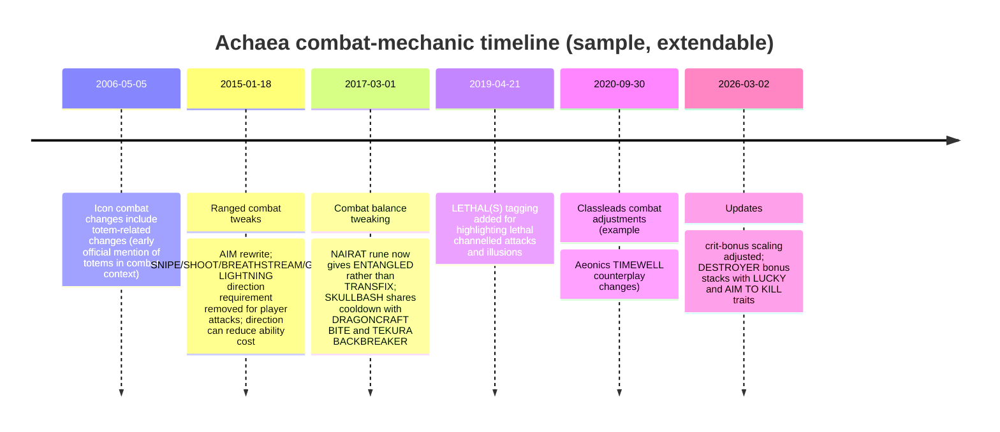

# Collecting and Structuring Wiki Data for an AI-Driven Combat System

## Executive summary

This report designs an end-to-end, machine-readable extraction pipeline for the AchaeaWiki and proposes a combat-oriented knowledge representation suitable for an AI (or rules-plus-ML hybrid) capable of auto-attack/auto-defend decisioning across all classes, with priority coverage for Runewarden and Dragonhood/Dragoncraft. The AchaeaWiki runs on MediaWiki and provides both Action API and REST entry points, enabling high-fidelity crawling and revision-aware incremental updates without relying on HTML scraping. citeturn32view0turn33view0

Key observations from the current wiki content:

- The Runewarden “combat basics” page exists but is largely incomplete (“TBD” in multiple sections), so class combat intelligence must be derived primarily from the underlying skill pages (Weaponmastery, Runelore, Discipline) and universal combat pages (afflictions/curing/defences/tattoos). citeturn16view0turn11view0turn10view0turn11view1turn13view0turn12view3  
- Dragonhood is implemented as a form/attainment and is represented in the wiki primarily through the Dragoncraft general skill and related trait/item/defence pages (e.g., traits that modify breath weapon behavior). citeturn25view0turn8view0turn20view0  
- Core combat semantics needed for “auto-defend” (affliction → cure mapping, timing resources like balance/equilibrium, escape mechanics like writhe, and defensive tattoos like Shield/Tree) are directly represented in dedicated pages/tables, but some structured fields across skills (e.g., “Channels”, “Shapes”, “Attune Effect”) appear as unexpanded template placeholders, creating predictable missingness you must model explicitly. citeturn12view3turn17view0turn22view0turn38search1turn38search2turn11view0turn8view0turn10view0  

Deliverables included below:

- A comprehensive JSON Schema for a unified “combat knowledge base” (entities: classes, skills, abilities, effects, cures, items, equipment, formulas, patch notes), plus example JSON files populated with verified fields from Runewarden/Runelore/Dragoncraft/Tattoos/Afflictions/Curing. citeturn11view0turn8view0turn9view0turn38search1turn13view0turn12view3turn20view0  
- CSV/TSV outputs (sample tables) for page inventory, extraction coverage, and page→entity mapping. citeturn32view0turn33view0turn36view0turn39view0  
- A patch-note extraction model and a mermaid timeline illustrating combat-relevant changes from official Achaea posts (announce/classleads/blog updates), designed to be extended automatically. citeturn15search1turn15search5turn15search8turn26view0  
- A recommended AI feature set, flowcharts (mermaid), and evaluation metrics aligned to Achaea’s balance/equilibrium-centric combat loop. citeturn17view0turn13view0turn12view3turn38search1turn38search2  

Assumptions (explicit because the request leaves them unspecified):
- “Crawl entire wiki” is interpreted as crawling all readable public pages in the main namespaces (and relevant category/template pages needed to interpret combat data), while explicitly skipping login-only, user-specific, or restricted pages, and recording the skip reason. citeturn30view0turn33view0  
- Update frequency is treated as unknown; the system supports both full rebuilds and incremental updates driven by MediaWiki revision metadata and/or a scheduled crawl window. citeturn33view0turn35view0  
- Combat “optimality” is not assumed; the AI metadata layer is designed to store both wiki-derived mechanics and empirical tuning extracted from logs/tests. citeturn17view0turn25view0  

## Source landscape and crawl architecture

AchaeaWiki is a MediaWiki installation (MediaWiki 1.39.13) with explicit entry points: `/mediawiki/index.php` for rendered pages, `/mediawiki/api.php` for the Action API, and `/mediawiki/rest.php` for REST endpoints. citeturn32view0 The wiki also exposes the auto-generated API help (useful for discovering supported modules and examples). citeturn33view0turn35view0

### Public crawling scope and “avoid private/login-only”
MediaWiki provides “Special pages” (e.g., Special:RecentChanges, Special:Export, Special:Version) and read endpoints. Some special tools (e.g., the API sandbox UI) may require JavaScript, but the underlying API endpoints remain usable. citeturn30view0turn31view0turn33view0  
To avoid restricted content:
- Prefer API discovery of pages and metadata (pageid, namespace, lastrevid, touched timestamp) and then fetch content only for pages that are readable without authentication. citeturn36view1turn33view0  
- Record HTTP/API errors (e.g., permission errors), store the URL and failure code, and exclude the page from the “public dataset” build while preserving it in the “crawl manifest” for auditability. citeturn33view0  

### Politeness and operational etiquette
Even with “no rate-limit constraints,” MediaWiki strongly recommends polite behavior: serial requests rather than heavy parallelism and using `maxlag` for non-interactive tasks to avoid adding load during replication lag. citeturn27search5turn27search1turn33view0  
AchaeaWiki’s API help explicitly documents `maxlag` and points to MediaWiki’s maxlag behavior and error semantics. citeturn33view0turn27search1

### Crawl phases (recommended)
1. **Discovery (page inventory):** Use `action=query&list=allpages` (and its generator form) to enumerate all pages and drive a stable crawl manifest keyed by `pageid` and `title`. The AchaeaWiki API help includes working allpages examples and shows how continuation works. citeturn35view0turn36view0  
2. **Metadata enrichment:** Use `prop=info` (via generator) to attach `lastrevid`, `touched`, `length`, and content model. citeturn36view1turn35view0  
3. **Content retrieval (wikitext-first):** Use `prop=revisions&rvprop=content` (with modern slot parameters in real implementation) to fetch wikitext. The API provides revision content retrieval and warns when legacy formats are used if slots aren’t specified—this should be modeled as a parser configuration. citeturn36view2turn33view0turn27search0turn27search8  
4. **Template expansion and normalization:** Many skill pages present consistent “Ability blocks” but sometimes contain unresolved template placeholders (e.g., `{{{channels}}}`, `{{{note}}}`). You should store both raw wikitext and a “normalized facts” layer with explicit `null/unknown` markers where the wiki lacks resolved values. citeturn8view0turn10view0turn11view0turn33view0  
5. **Domain-specific extraction:** Prioritize:
   - Classes and skills: Category:Classes (canonical class↔skill mapping) and each skill page (abilities, syntax, cooldowns, requirements). citeturn39view0turn10view0turn11view0turn11view1turn8view0  
   - Combat core: Category:Afflictions, Curing table, Tattoos and key tattoo pages, Armour, Writhe, critical hit multipliers. citeturn13view0turn12view3turn38search0turn38search1turn38search2turn12view0turn22view0turn12view2  
6. **Packaging:** Emit validated JSON (entity files or JSONL), plus CSV/TSV for human QA and progress tracking, and retain a provenance ledger (source URL + oldid + extracted fields + confidence). citeturn16view0turn8view0turn39view0

### Primary-source prioritization and provenance
AchaeaWiki’s Main Page describes it as the official wiki and indicates contribution is tied to in-game authentication; this supports treating wiki pages as primary content while still tracking revision IDs and citations per extracted datum. citeturn28search0turn32view0  
For combat changes over time, official Achaea posts provide date-stamped update notes and should be ingested as a parallel “patch-note corpus.” citeturn26view0turn15search1turn15search5turn15search7

## Data model and comprehensive JSON Schema

The extraction target is a **combat knowledge base (KB)** that merges:  
(1) declarative mechanics (skills/abilities/statuses/cures/items),  
(2) operational constraints (cooldowns, balance/equilibrium usage, resource costs),  
(3) interaction rules (counters, immunities, resistances), and  
(4) AI-relevant metadata (priority, typical sequences, counterplay).

The schema below is designed to remain correct even when the wiki is incomplete: it supports `unknown` values, multiple sources per field, and confidence scoring.

The KB should treat **provenance as first-class** by storing `source.url` and `source.oldid` for every extracted entity/field, matching the wiki’s “Permanent link / oldid” pattern visible on many pages. citeturn16view0turn8view0turn11view0turn12view0

```json
{
  "$schema": "https://json-schema.org/draft/2020-12/schema",
  "$id": "https://example.invalid/schemas/achaea-combat-kb.schema.json",
  "title": "Achaea Combat Knowledge Base Schema",
  "type": "object",
  "required": ["meta", "entities"],
  "properties": {
    "meta": {
      "type": "object",
      "required": ["generated_at", "wiki", "build"],
      "properties": {
        "generated_at": { "type": "string", "format": "date-time" },
        "wiki": {
          "type": "object",
          "required": ["base_url", "api_url"],
          "properties": {
            "base_url": { "type": "string" },
            "api_url": { "type": "string" },
            "rest_url": { "type": "string" },
            "mediawiki_version": { "type": "string" }
          },
          "additionalProperties": false
        },
        "build": {
          "type": "object",
          "required": ["strategy", "scope"],
          "properties": {
            "strategy": {
              "type": "string",
              "enum": ["full", "incremental"]
            },
            "scope": {
              "type": "object",
              "required": ["public_only", "namespaces"],
              "properties": {
                "public_only": { "type": "boolean" },
                "namespaces": {
                  "type": "array",
                  "items": { "type": "integer" }
                },
                "category_roots": {
                  "type": "array",
                  "items": { "type": "string" }
                }
              },
              "additionalProperties": false
            },
            "notes": { "type": "string" }
          },
          "additionalProperties": false
        }
      },
      "additionalProperties": false
    },
    "entities": {
      "type": "array",
      "items": { "$ref": "#/$defs/Entity" }
    }
  },
  "$defs": {
    "Entity": {
      "type": "object",
      "required": ["id", "kind", "name", "sources"],
      "properties": {
        "id": { "type": "string", "pattern": "^[a-z0-9_.:-]+$" },
        "kind": {
          "type": "string",
          "enum": [
            "page",
            "class",
            "skill",
            "ability",
            "status_effect",
            "cure",
            "item",
            "equipment",
            "formula",
            "patch_note"
          ]
        },
        "name": { "type": "string" },
        "summary": { "type": "string" },
        "sources": {
          "type": "array",
          "minItems": 1,
          "items": { "$ref": "#/$defs/SourceRef" }
        },
        "data_quality": { "$ref": "#/$defs/DataQuality" },
        "tags": {
          "type": "array",
          "items": { "type": "string" }
        }
      },
      "allOf": [
        {
          "if": { "properties": { "kind": { "const": "page" } } },
          "then": { "$ref": "#/$defs/PageEntity" }
        },
        {
          "if": { "properties": { "kind": { "const": "class" } } },
          "then": { "$ref": "#/$defs/ClassEntity" }
        },
        {
          "if": { "properties": { "kind": { "const": "skill" } } },
          "then": { "$ref": "#/$defs/SkillEntity" }
        },
        {
          "if": { "properties": { "kind": { "const": "ability" } } },
          "then": { "$ref": "#/$defs/AbilityEntity" }
        },
        {
          "if": { "properties": { "kind": { "const": "status_effect" } } },
          "then": { "$ref": "#/$defs/StatusEffectEntity" }
        },
        {
          "if": { "properties": { "kind": { "const": "cure" } } },
          "then": { "$ref": "#/$defs/CureEntity" }
        },
        {
          "if": { "properties": { "kind": { "const": "item" } } },
          "then": { "$ref": "#/$defs/ItemEntity" }
        },
        {
          "if": { "properties": { "kind": { "const": "equipment" } } },
          "then": { "$ref": "#/$defs/EquipmentEntity" }
        },
        {
          "if": { "properties": { "kind": { "const": "formula" } } },
          "then": { "$ref": "#/$defs/FormulaEntity" }
        },
        {
          "if": { "properties": { "kind": { "const": "patch_note" } } },
          "then": { "$ref": "#/$defs/PatchNoteEntity" }
        }
      ],
      "additionalProperties": true
    },

    "SourceRef": {
      "type": "object",
      "required": ["url", "retrieved_at"],
      "properties": {
        "url": { "type": "string" },
        "oldid": { "type": ["integer", "string", "null"] },
        "retrieved_at": { "type": "string", "format": "date-time" },
        "source_type": {
          "type": "string",
          "enum": ["achaeawiki", "official_patch_notes", "official_news", "other"]
        },
        "field_paths": {
          "description": "Optional JSON-pointer-like paths indicating which fields were derived from this source.",
          "type": "array",
          "items": { "type": "string" }
        },
        "notes": { "type": "string" }
      },
      "additionalProperties": false
    },

    "DataQuality": {
      "type": "object",
      "properties": {
        "completeness": { "type": "number", "minimum": 0, "maximum": 1 },
        "confidence": { "type": "number", "minimum": 0, "maximum": 1 },
        "missing_fields": {
          "type": "array",
          "items": { "type": "string" }
        },
        "issues": {
          "type": "array",
          "items": { "type": "string" }
        }
      },
      "additionalProperties": false
    },

    "PageEntity": {
      "type": "object",
      "required": ["page"],
      "properties": {
        "page": {
          "type": "object",
          "required": ["title", "pageid"],
          "properties": {
            "title": { "type": "string" },
            "pageid": { "type": ["integer", "null"] },
            "namespace": { "type": ["integer", "null"] },
            "lastrevid": { "type": ["integer", "null"] },
            "touched": { "type": ["string", "null"], "format": "date-time" },
            "contentmodel": { "type": ["string", "null"] },
            "categories": {
              "type": "array",
              "items": { "type": "string" }
            }
          },
          "additionalProperties": false
        }
      },
      "additionalProperties": true
    },

    "ClassEntity": {
      "type": "object",
      "required": ["class"],
      "properties": {
        "class": {
          "type": "object",
          "required": ["skills"],
          "properties": {
            "skills": {
              "description": "Skill IDs in the class kit (fledgling + full member).",
              "type": "array",
              "items": { "type": "string" }
            },
            "archetype": {
              "type": ["string", "null"],
              "description": "E.g., knight, mage, etc."
            },
            "alignment": { "type": ["string", "null"] },
            "notes": { "type": "string" }
          },
          "additionalProperties": false
        }
      },
      "additionalProperties": true
    },

    "SkillEntity": {
      "type": "object",
      "required": ["skill"],
      "properties": {
        "skill": {
          "type": "object",
          "required": ["abilities"],
          "properties": {
            "abilities": {
              "type": "array",
              "items": { "type": "string" }
            },
            "availability": {
              "type": "object",
              "properties": {
                "classes": {
                  "type": "array",
                  "items": { "type": "string" }
                },
                "general_skill": { "type": "boolean" }
              },
              "additionalProperties": false
            }
          },
          "additionalProperties": false
        }
      },
      "additionalProperties": true
    },

    "AbilityEntity": {
      "type": "object",
      "required": ["ability"],
      "properties": {
        "ability": {
          "type": "object",
          "required": ["commands", "targeting", "cooldown", "effects"],
          "properties": {
            "commands": {
              "type": "array",
              "items": { "type": "string" }
            },
            "lessons": { "type": ["integer", "null"] },
            "requirements": {
              "type": "object",
              "properties": {
                "skill_rank": { "type": ["string", "null"] },
                "items": {
                  "type": "array",
                  "items": { "type": "string" }
                },
                "resources": { "$ref": "#/$defs/ResourceCost" }
              },
              "additionalProperties": false
            },
            "cooldown": { "$ref": "#/$defs/Cooldown" },
            "targeting": { "$ref": "#/$defs/Targeting" },
            "range": { "$ref": "#/$defs/Range" },
            "effects": {
              "type": "array",
              "items": { "$ref": "#/$defs/Effect" }
            },
            "counters": {
              "type": "array",
              "items": { "$ref": "#/$defs/Counter" }
            },
            "ai": { "$ref": "#/$defs/AIMetadata" }
          },
          "additionalProperties": false
        }
      },
      "additionalProperties": true
    },

    "ResourceCost": {
      "type": "object",
      "properties": {
        "mana": { "type": ["integer", "null"] },
        "endurance": { "type": ["integer", "null"] },
        "willpower": { "type": ["integer", "null"] },
        "rage": { "type": ["integer", "null"] },
        "wrath_percent": { "type": ["number", "null"], "minimum": 0, "maximum": 100 },
        "notes": { "type": "string" }
      },
      "additionalProperties": false
    },

    "Cooldown": {
      "type": "object",
      "required": ["kind"],
      "properties": {
        "kind": {
          "type": "string",
          "enum": ["balance", "equilibrium", "both", "variable", "none", "unknown"]
        },
        "seconds": { "type": ["number", "null"] },
        "notes": { "type": "string" }
      },
      "additionalProperties": false
    },

    "Targeting": {
      "type": "object",
      "required": ["works_against"],
      "properties": {
        "works_against": {
          "type": "array",
          "items": {
            "type": "string",
            "enum": ["self", "adventurer", "denizen", "room", "object", "unknown"]
          }
        },
        "requires_prone": { "type": ["boolean", "null"] },
        "requires_line_of_sight": { "type": ["boolean", "null"] },
        "requires_adjacent": { "type": ["boolean", "null"] },
        "notes": { "type": "string" }
      },
      "additionalProperties": false
    },

    "Range": {
      "type": "object",
      "properties": {
        "type": { "type": "string", "enum": ["melee", "room", "adjacent", "line_of_sight", "global", "unknown"] },
        "max_rooms": { "type": ["integer", "null"] },
        "notes": { "type": "string" }
      },
      "additionalProperties": false
    },

    "Effect": {
      "type": "object",
      "required": ["type"],
      "properties": {
        "type": {
          "type": "string",
          "enum": [
            "damage",
            "apply_status",
            "remove_status",
            "buff",
            "debuff",
            "defence",
            "strip_defence",
            "movement_restrict",
            "prone",
            "disarm",
            "resource_drain",
            "unknown"
          ]
        },
        "damage": { "$ref": "#/$defs/Damage" },
        "status_id": { "type": ["string", "null"] },
        "duration_seconds": { "type": ["number", "null"] },
        "notes": { "type": "string" }
      },
      "additionalProperties": false
    },

    "Damage": {
      "type": "object",
      "properties": {
        "damage_type": {
          "type": "string",
          "enum": ["cutting", "blunt", "fire", "cold", "electric", "poison", "magic", "psychic", "unknown"]
        },
        "amount_model": {
          "type": "string",
          "enum": ["flat", "percent_maxhp", "scales_with_stats", "unknown"]
        },
        "amount": { "type": ["number", "null"] },
        "notes": { "type": "string" }
      },
      "additionalProperties": false
    },

    "Counter": {
      "type": "object",
      "properties": {
        "counter_type": {
          "type": "string",
          "enum": ["prevents", "removes", "mitigates", "punishes", "unknown"]
        },
        "by_entity_id": { "type": "string" },
        "notes": { "type": "string" }
      },
      "additionalProperties": false
    },

    "AIMetadata": {
      "type": "object",
      "properties": {
        "role": { "type": "string", "enum": ["offense", "defense", "utility", "setup", "finisher", "unknown"] },
        "priority": { "type": ["integer", "null"], "minimum": 0 },
        "typical_sequences": {
          "type": "array",
          "items": {
            "type": "object",
            "properties": {
              "sequence": { "type": "array", "items": { "type": "string" } },
              "goal": { "type": "string" },
              "notes": { "type": "string" }
            },
            "additionalProperties": false
          }
        },
        "risk": { "type": "string", "enum": ["low", "medium", "high", "unknown"] },
        "notes": { "type": "string" }
      },
      "additionalProperties": false
    },

    "StatusEffectEntity": {
      "type": "object",
      "required": ["status_effect"],
      "properties": {
        "status_effect": {
          "type": "object",
          "required": ["status_type"],
          "properties": {
            "status_type": { "type": "string", "enum": ["affliction", "defence", "limb_state", "stance", "unknown"] },
            "effect_text": { "type": "string" },
            "cures": {
              "type": "array",
              "items": { "type": "string" }
            },
            "immunities": {
              "type": "array",
              "items": { "type": "string" }
            }
          },
          "additionalProperties": false
        }
      },
      "additionalProperties": true
    },

    "CureEntity": {
      "type": "object",
      "required": ["cure"],
      "properties": {
        "cure": {
          "type": "object",
          "required": ["method", "targets"],
          "properties": {
            "method": { "type": "string", "enum": ["eat", "smoke", "apply", "focus", "writhe", "other"] },
            "item_id": { "type": ["string", "null"] },
            "targets": { "type": "array", "items": { "type": "string" } },
            "cooldown": { "$ref": "#/$defs/Cooldown" }
          },
          "additionalProperties": false
        }
      },
      "additionalProperties": true
    },

    "ItemEntity": {
      "type": "object",
      "required": ["item"],
      "properties": {
        "item": {
          "type": "object",
          "properties": {
            "item_type": { "type": "string", "enum": ["consumable", "artefact", "talisman", "ingredient", "unknown"] },
            "effects": { "type": "array", "items": { "$ref": "#/$defs/Effect" } },
            "grants_immunity_to": { "type": "array", "items": { "type": "string" } }
          },
          "additionalProperties": false
        }
      },
      "additionalProperties": true
    },

    "EquipmentEntity": {
      "type": "object",
      "required": ["equipment"],
      "properties": {
        "equipment": {
          "type": "object",
          "properties": {
            "slot": { "type": ["string", "null"] },
            "armour_type": { "type": ["string", "null"] },
            "weapon_type": { "type": ["string", "null"] },
            "stats": {
              "type": "object",
              "properties": {
                "damage_resistance": {
                  "type": "object",
                  "additionalProperties": { "type": "number" }
                }
              },
              "additionalProperties": true
            }
          },
          "additionalProperties": false
        }
      },
      "additionalProperties": true
    },

    "FormulaEntity": {
      "type": "object",
      "required": ["formula"],
      "properties": {
        "formula": {
          "type": "object",
          "required": ["domain"],
          "properties": {
            "domain": { "type": "string", "enum": ["damage", "crit", "cooldown", "resistance", "other"] },
            "expression": { "type": "string" },
            "variables": {
              "type": "array",
              "items": { "type": "string" }
            }
          },
          "additionalProperties": false
        }
      },
      "additionalProperties": true
    },

    "PatchNoteEntity": {
      "type": "object",
      "required": ["patch_note"],
      "properties": {
        "patch_note": {
          "type": "object",
          "required": ["published_date", "items"],
          "properties": {
            "published_date": { "type": "string", "format": "date" },
            "title": { "type": "string" },
            "channel": { "type": "string", "enum": ["announce", "classleads", "blog", "other"] },
            "items": {
              "type": "array",
              "items": {
                "type": "object",
                "required": ["text"],
                "properties": {
                  "text": { "type": "string" },
                  "entities_mentioned": { "type": "array", "items": { "type": "string" } },
                  "impact": { "type": "string", "enum": ["buff", "nerf", "bugfix", "mechanic_change", "unknown"] }
                },
                "additionalProperties": false
              }
            }
          },
          "additionalProperties": false
        }
      },
      "additionalProperties": true
    }
  },
  "additionalProperties": false
}
```

## Example structured outputs and tabular deliverables

The examples below are **illustrative “golden samples”** showing how to represent real extracted facts with provenance. Values shown are taken directly from cited pages; fields not present in the wiki are explicitly `null` or tagged as unknown.

### Example JSON files

Runewardens are described as practicing Weaponmastery, Runelore, and Discipline; Category:Classes also provides the canonical class→skill mapping, and the Runewarden page includes class-specific Battlerage abilities (not all combat-relevant to PvP, but structured and costed). citeturn9view0turn39view0turn12view4

```json
{
  "id": "class.runewarden",
  "kind": "class",
  "name": "Runewarden",
  "summary": "A knight class that practices Weaponmastery, Runelore, and Discipline.",
  "sources": [
    {
      "url": "https://wiki.achaea.com/mediawiki/index.php?title=Runewarden&oldid=43382",
      "oldid": 43382,
      "retrieved_at": "2026-03-06T12:00:00-05:00",
      "source_type": "achaeawiki",
      "field_paths": ["/class/skills", "/summary"]
    },
    {
      "url": "https://wiki.achaea.com/mediawiki/index.php?title=Category:Classes&oldid=46322",
      "oldid": 46322,
      "retrieved_at": "2026-03-06T12:00:00-05:00",
      "source_type": "achaeawiki",
      "field_paths": ["/class/skills"]
    }
  ],
  "class": {
    "skills": [
      "skill.weaponmastery",
      "skill.runelore",
      "skill.discipline"
    ],
    "archetype": "knight",
    "alignment": null,
    "notes": "Combat:Runewarden currently contains multiple TBD placeholders; rely on skill pages for mechanics."
  },
  "data_quality": {
    "completeness": 0.65,
    "confidence": 0.9,
    "missing_fields": ["alignment", "class_summary_combat_strategy"],
    "issues": ["Combat guide page incomplete (TBD sections)."]
  }
}
```

Runelore explicitly defines rune sketching, material requirements (inks), cooldowns, target scope, and (critically for totem automation) “configuration” notes including attune conditions and empower effects on some runes such as Kena. citeturn11view0

```json
{
  "id": "ability.runelore.kena",
  "kind": "ability",
  "name": "Kena",
  "summary": "A rune to inspire fear; disappears after one use unless on a totem.",
  "sources": [
    {
      "url": "https://wiki.achaea.com/mediawiki/index.php?title=Runelore&oldid=???",
      "oldid": null,
      "retrieved_at": "2026-03-06T12:00:00-05:00",
      "source_type": "achaeawiki",
      "notes": "Oldid not captured in the excerpt view; production pipeline should resolve oldid via API or permanent link."
    }
  ],
  "ability": {
    "commands": [
      "SKETCH KENA ON GROUND/<totem>"
    ],
    "lessons": null,
    "requirements": {
      "skill_rank": null,
      "items": ["item.ink.red"],
      "resources": {
        "mana": null,
        "endurance": null,
        "willpower": null,
        "rage": null,
        "wrath_percent": null,
        "notes": "Requires 1 Red Ink."
      }
    },
    "cooldown": {
      "kind": "balance",
      "seconds": 2.0,
      "notes": null
    },
    "targeting": {
      "works_against": ["adventurer"],
      "requires_prone": null,
      "requires_line_of_sight": null,
      "requires_adjacent": null,
      "notes": "Triggered when an enemy 'enters and sees it' per the description."
    },
    "range": { "type": "room", "max_rooms": null, "notes": null },
    "effects": [
      {
        "type": "apply_status",
        "status_id": "status.fear",
        "duration_seconds": null,
        "notes": "Inspires fear; disappears after one use unless on a totem."
      }
    ],
    "counters": [],
    "ai": {
      "role": "setup",
      "priority": 60,
      "typical_sequences": [
        {
          "sequence": ["ability.runelore.sketch", "ability.runelore.kena"],
          "goal": "Area denial / totem trap setup",
          "notes": "Effect depends on visibility and target entering."
        }
      ],
      "risk": "medium",
      "notes": "Also includes configuration metadata: attune condition and empower effect recorded as notes."
    }
  },
  "data_quality": {
    "completeness": 0.7,
    "confidence": 0.75,
    "missing_fields": ["exact_status_name_mapping", "duration_seconds"],
    "issues": ["Attune/Empower are described as free text; requires parsing to structured triggers."]
  }
}
```

Dragonhood is described as a level 99 attainment and Dragoncraft is the associated general skill. Dragoncraft itself provides many combat-relevant abilities with explicit cooldown and costs (e.g., DRAGONFORM cooldown, SUMMON cost, BREATHSTREAM targeting constraints, and Devour behavior). citeturn25view0turn8view0turn7search9

```json
{
  "id": "skill.dragoncraft",
  "kind": "skill",
  "name": "Dragoncraft",
  "summary": "Greater Dragon-exclusive abilities, available upon reaching level 99 and dragonhood.",
  "sources": [
    {
      "url": "https://wiki.achaea.com/mediawiki/index.php?title=Dragoncraft&oldid=47286",
      "oldid": 47286,
      "retrieved_at": "2026-03-06T12:00:00-05:00",
      "source_type": "achaeawiki"
    },
    {
      "url": "https://www.achaea.com/front",
      "oldid": null,
      "retrieved_at": "2026-03-06T12:00:00-05:00",
      "source_type": "official_news",
      "notes": "Front page describes dragonhood at level 99, six dragon colours, and that Dragoncraft has 35 dragon-specific abilities."
    }
  ],
  "skill": {
    "abilities": [
      "ability.dragoncraft.dragonform",
      "ability.dragoncraft.summon",
      "ability.dragoncraft.breathstream",
      "ability.dragoncraft.devour"
    ],
    "availability": {
      "classes": [],
      "general_skill": true
    }
  },
  "data_quality": {
    "completeness": 0.8,
    "confidence": 0.85,
    "missing_fields": ["full_ability_index"],
    "issues": ["Some Dragoncraft fields appear as template placeholders (channels/shapes/etc) and should be treated as unknown."]
  }
}
```

Dragoncraft’s SUMMON ability provides a structured mapping from dragon colour to breath damage type and secondary effects (e.g., black acid “unblockable damage,” silver lightning “high chance of epilepsy”). citeturn8view0turn25view0

```json
{
  "id": "ability.dragoncraft.summon",
  "kind": "ability",
  "name": "Summon",
  "summary": "Summon your dragon breath weapon; breath type depends on dragon colour.",
  "sources": [
    {
      "url": "https://wiki.achaea.com/mediawiki/index.php?title=Dragoncraft&oldid=47286",
      "oldid": 47286,
      "retrieved_at": "2026-03-06T12:00:00-05:00",
      "source_type": "achaeawiki"
    }
  ],
  "ability": {
    "commands": ["SUMMON <breath weapon type>"],
    "requirements": {
      "skill_rank": null,
      "items": [],
      "resources": { "mana": 300, "endurance": null, "willpower": null, "rage": null, "wrath_percent": null, "notes": null }
    },
    "cooldown": { "kind": "unknown", "seconds": null, "notes": "Cooldown not specified on the page." },
    "targeting": { "works_against": ["self"], "requires_prone": null, "requires_line_of_sight": null, "requires_adjacent": null, "notes": null },
    "range": { "type": "unknown", "max_rooms": null, "notes": null },
    "effects": [
      { "type": "buff", "damage": null, "status_id": "status.breath_summoned", "duration_seconds": null, "notes": "Enables breath attacks that require a summoned breath." }
    ],
    "counters": [],
    "ai": {
      "role": "setup",
      "priority": 80,
      "typical_sequences": [
        {
          "sequence": ["ability.dragoncraft.summon", "ability.dragoncraft.blast"],
          "goal": "Enable breath damage application",
          "notes": "Multiple breath attacks explicitly require summoned breath on the page."
        }
      ],
      "risk": "low",
      "notes": "Colour mapping stored as structured notes in this example; production KB should store as separate 'breath_profile' entities."
    }
  },
  "breath_profiles": [
    { "dragon_colour": "black", "damage_type": "unknown", "notes": "Acid; described as unblockable damage." },
    { "dragon_colour": "blue", "damage_type": "cold", "notes": "Chance of becoming frozen." },
    { "dragon_colour": "gold", "damage_type": "psychic", "notes": "Psi damage; chance of equilibrium loss." },
    { "dragon_colour": "green", "damage_type": "poison", "notes": "Chance of a random venom affliction." },
    { "dragon_colour": "red", "damage_type": "fire", "notes": "Sets the target on fire also." },
    { "dragon_colour": "silver", "damage_type": "electric", "notes": "High chance of epilepsy." }
  ],
  "data_quality": {
    "completeness": 0.75,
    "confidence": 0.85,
    "missing_fields": ["cooldown.seconds", "formal_secondary_effect_probability"],
    "issues": ["Secondary effect chances are qualitative; must be learned empirically or from official numeric docs if available."]
  }
}
```

Afflictions and cures are best represented as **two linked entity sets**:  
- `status_effect` entities (what the affliction does; how it is applied; how long it lasts if known), and  
- `cure` entities (action + curative item + cooldown model).  

The Category:Afflictions page gives a large affliction list including effect summaries and cures (e.g., Anorexia: cannot eat; cured by Epidermal applied and Focus). citeturn13view0

```json
{
  "id": "status.affliction.anorexia",
  "kind": "status_effect",
  "name": "Anorexia",
  "summary": "Makes it impossible to eat anything.",
  "sources": [
    {
      "url": "https://wiki.achaea.com/Category:Afflictions",
      "oldid": null,
      "retrieved_at": "2026-03-06T12:00:00-05:00",
      "source_type": "achaeawiki"
    }
  ],
  "status_effect": {
    "status_type": "affliction",
    "effect_text": "Makes it impossible to eat anything.",
    "cures": [
      "cure.apply.epidermal",
      "cure.focus"
    ],
    "immunities": []
  },
  "data_quality": {
    "completeness": 0.6,
    "confidence": 0.8,
    "missing_fields": ["duration_seconds", "stacking_rules"],
    "issues": ["Category page provides summary-level mechanics; dedicated affliction pages may add nuance."]
  }
}
```

The Curing page presents an explicit affliction→(action, herbal cure, alchemical cure) table, which should be ingested as the canonical “default curing map” for auto-defend logic. citeturn12view3

```json
{
  "id": "table.curing.default",
  "kind": "cure",
  "name": "Default curing map (table extract)",
  "summary": "Affliction-to-cure mapping as shown on the Curing page.",
  "sources": [
    {
      "url": "https://wiki.achaea.com/Curing",
      "oldid": null,
      "retrieved_at": "2026-03-06T12:00:00-05:00",
      "source_type": "achaeawiki"
    }
  ],
  "cure": {
    "method": "other",
    "item_id": null,
    "targets": [
      "status.affliction.addiction",
      "status.affliction.agoraphobia",
      "status.affliction.anorexia",
      "status.affliction.asthma"
    ],
    "cooldown": { "kind": "unknown", "seconds": null, "notes": "Cooldowns vary by cure type; Combat:Overview describes typical pacing but should be empirically verified." }
  },
  "data_quality": {
    "completeness": 0.5,
    "confidence": 0.75,
    "missing_fields": ["full_table_ingestion", "per_cure_cooldowns"],
    "issues": ["Table contains many rows; production ingestion must parse full page table structure."]
  }
}
```

Tattoos form a core defensive/offensive mechanic; key pages provide crisp interaction rules: Shield tattoo creates a magical shield that dissolves on movement or aggressive acts and is countered by Hammer tattoo; Web tattoo entangles and can be avoided by specific artefacts; Tree tattoo cures “nearly any affliction” but imposes recovery limitations. citeturn38search1turn38search9turn38search3turn38search2turn22view0turn38search16

```json
{
  "id": "defence.tattoo.shield",
  "kind": "status_effect",
  "name": "Shield tattoo defence",
  "summary": "Magical shield defence granted by touching the shield tattoo; dissolves on movement or aggressive acts.",
  "sources": [
    {
      "url": "https://wiki.achaea.com/mediawiki/index.php?title=Shield_tattoo&oldid=43926",
      "oldid": 43926,
      "retrieved_at": "2026-03-06T12:00:00-05:00",
      "source_type": "achaeawiki"
    },
    {
      "url": "https://wiki.achaea.com/mediawiki/index.php?title=Hammer_tattoo&oldid=15583",
      "oldid": 15583,
      "retrieved_at": "2026-03-06T12:00:00-05:00",
      "source_type": "achaeawiki"
    }
  ],
  "status_effect": {
    "status_type": "defence",
    "effect_text": "Creates a magical shield that protects from most forms of attack; dissolves when bearer moves or performs an aggressive act; some attacks can penetrate it; hammer tattoo shatters it.",
    "cures": [],
    "immunities": []
  },
  "data_quality": {
    "completeness": 0.75,
    "confidence": 0.9,
    "missing_fields": ["exact_penetrating_attack_list"],
    "issues": ["Penetration exceptions are described qualitatively; requires enumerating from ability pages or help files."]
  }
}
```

### CSV/TSV table: pages and data completeness

The table below is a **sample** of what your full crawl’s “coverage dashboard” should look like after running extraction. It emphasizes Runewarden + Dragoncraft + universal combat mechanics. Page IDs/oldids should be resolved via the API in a production build. citeturn36view0turn36view1turn39view0turn32view0

```tsv
page_title	namespace	url	entity_kinds_detected	has_structured_ability_blocks	has_syntax	has_cooldown	has_resource_cost	has_tables	completeness_score	notes
Runewarden	0	https://wiki.achaea.com/Runewarden	class,ability	yes	yes	yes	yes	no	0.70	Contains Battlerage abilities with syntax/cooldown/resource; class overview is brief.
Combat:Runewarden	0	https://wiki.achaea.com/Combat:Runewarden	page	partial	no	no	no	no	0.15	Multiple sections are "TBD"; unsuitable as primary combat source.
Weaponmastery	0	https://wiki.achaea.com/Weaponmastery	skill,ability	yes	yes	yes	partial	no	0.75	Many ability entries; some fields show unresolved template placeholders.
Runelore	0	https://wiki.achaea.com/Runelore	skill,ability,item	yes	yes	yes	yes	partial	0.80	Runes include required inks and configuration notes (attune/empower).
Discipline	0	https://wiki.achaea.com/Discipline	skill,ability,item	yes	yes	partial	partial	no	0.65	Contains falconry and archery-related mechanics; some cooldowns absent.
Dragoncraft	0	https://wiki.achaea.com/Dragoncraft	skill,ability	yes	yes	yes	yes	no	0.75	Core Dragon abilities; several placeholder fields in template slots.
Traits	0	https://wiki.achaea.com/Traits	item,status_effect	yes	partial	no	no	yes	0.70	Trait table includes dragon-only trait effects (e.g., breath bypass shield).
Category:Afflictions	14	https://wiki.achaea.com/Category:Afflictions	status_effect,cure	yes	partial	no	no	yes	0.85	Large affliction list includes effects, sources, cures.
Curing	0	https://wiki.achaea.com/Curing	cure	yes	partial	no	no	yes	0.90	Explicit affliction→(action, herbal cure, alchemical cure) table.
Shield tattoo	0	https://wiki.achaea.com/Shield_tattoo	status_effect,item	no	partial	no	no	no	0.80	Defines shield behavior and interactions (dissolve on move/aggression).
Critical hits	0	https://wiki.achaea.com/Critical_hits	formula	yes	no	no	no	yes	0.60	Contains explicit damage multipliers up to 64x.
Armour	0	https://wiki.achaea.com/Armour	equipment	yes	no	no	no	yes	0.55	Lists armour tiers and max armour by class; lacks numeric mitigation stats.
Combat:Overview	0	https://wiki.achaea.com/Combat:Overview	page	partial	no	no	no	no	0.50	Narrative combat mechanics incl. balance/equilibrium; may be partly dated.
```

### TSV table: mapping wiki pages to extracted entities

This is a minimal example of the mapping output; in a full run it should cover all pages, including category pages that define canonical lists (classes, afflictions, tattoos). citeturn39view0turn13view0turn38search12turn8view0turn11view0turn33view0

```tsv
page_title	url	entity_id	entity_kind
Category:Classes	https://wiki.achaea.com/Category:Classes	vocab.classes	index_page
Runewarden	https://wiki.achaea.com/Runewarden	class.runewarden	class
Weaponmastery	https://wiki.achaea.com/Weaponmastery	skill.weaponmastery	skill
Runelore	https://wiki.achaea.com/Runelore	skill.runelore	skill
Discipline	https://wiki.achaea.com/Discipline	skill.discipline	skill
Dragoncraft	https://wiki.achaea.com/Dragoncraft	skill.dragoncraft	skill
Category:Afflictions	https://wiki.achaea.com/Category:Afflictions	vocab.afflictions	index_page
Curing	https://wiki.achaea.com/Curing	table.curing.default	cure
Shield tattoo	https://wiki.achaea.com/Shield_tattoo	defence.tattoo.shield	status_effect
Hammer tattoo	https://wiki.achaea.com/Hammer_tattoo	ability.tattoo.hammer	item_or_ability
Web tattoo	https://wiki.achaea.com/Web_tattoo	ability.tattoo.web	item_or_ability
Tree tattoo	https://wiki.achaea.com/Tree_tattoo	ability.tattoo.tree	item_or_ability
Traits	https://wiki.achaea.com/Traits	vocab.traits	index_page
```

## Patch notes and change timeline

### Patch-note corpus and extraction plan

Achaea provides official, dated update notes across multiple channels (e.g., Announce news posts and longer-form “Game Updates” pages). These are critical to keep the KB temporally correct because combat mechanics—especially cooldowns, shared cooldown groups, and counterplay—can change over time. citeturn26view0turn15search1turn15search5turn15search7

Recommended approach:
- Crawl official posts under stable URL patterns (examples already show: `/news/announce/<id>`, `/news/classleads/<id>`, and dated blog entries). citeturn15search1turn15search7turn15search5  
- Parse the post body into atomic “change items,” preserving original order; attach `published_date`, `channel`, and detect entities mentioned (abilities, runes, skills) via dictionary lookup against the extracted wiki KB. citeturn15search5turn15search1turn8view0turn11view0  
- Store changes as `patch_note` entities and optionally annotate affected KB entities with `changed_in` references, enabling time-travel queries (“what was the cooldown behavior on date X?”). citeturn33view0turn36view1  

### Combat-relevant examples visible in official notes

- **Ranged combat adjustments** explicitly mention DRAGONCRAFT BREATHSTREAM and change its direction argument requirements (and a direction may reduce balance/equilibrium cost). This is directly actionable for a targeting/range model. citeturn15search1turn8view0  
- **Combat balance tweaks** include a Runelore rune semantics change (NAIRAT now gives ENTANGLED rather than TRANSFIX) and a shared cooldown grouping involving DRAGONCRAFT BITE. Both changes must be versioned and reflected in the KB’s “status applied” and “shared cooldown group” modeling. citeturn15search5turn11view0turn8view0  
- A March 2, 2026 “Updates” post changes how a crit-rate bonus (“destroyer” bonus) scales and states it stacks with the LUCKY and AIM TO KILL traits—this affects damage expectation and may change AI risk thresholds. citeturn26view0turn20view0turn12view2  

### Mermaid timeline of notable combat-mechanic changes



Sources for the timeline items are the official posts shown above. citeturn15search12turn15search1turn15search5turn15search8turn15search7turn26view0

## Combat AI feature set, heuristics, and evaluation

### Combat loop constraints that the AI must respect

Achaea combat is built around **balance** and **equilibrium** as primary rate-limiters for actions; the Combat:Overview page explains that many offensive actions require balance and/or equilibrium and that healing modalities have their own timing constraints (e.g., salves/herbs often faster than health/mana elixirs). citeturn17view0  
The AI must therefore maintain an internal “action budget” per tick consisting of:
- readiness: `{has_balance, has_equilibrium}`,  
- per-category cure cooldowns (eat/smoke/apply/sip/focus/writhe),  
- and per-ability cooldowns (some expressed as seconds of balance/equilibrium, some variable/unspecified). citeturn17view0turn8view0turn11view0turn12view3

### Recommended AI feature set (combat-oriented KB + runtime state)

Core KB-backed features:
- **Entity resolver:** normalize references like “DRAGONHEAL”, “BREATHSTREAM”, “SKETCH KENA” to ability IDs, with syntax templates captured from skill pages. citeturn8view0turn11view0  
- **Status inference graph:** status effects from Category:Afflictions + Tattoos + skill abilities, including “apply status,” “remove status,” and “prevents action type” (e.g., anorexia stops eating; enmeshed stops parry). citeturn13view0turn38search3turn22view0turn8view0  
- **Cure planner:** ingest the Curing table as baseline and extend with special cures (e.g., Tree tattoo cures nearly any affliction but has recovery constraints). citeturn12view3turn38search2turn38search19  
- **Defence model:** track defences like shield tattoo and their known break conditions and counters (hammer tattoo breaks shield; shield dissolves on movement/aggression). citeturn38search1turn38search9  
- **Resource model:** mana/endurance/willpower/rage/wrath as structured costs; parse explicit numeric costs when present (e.g., Dragoncraft HEAL requires 1500 mana; Armour requires 500 mana and has ongoing costs of willpower/endurance; Runewarden Battlerage abilities consume rage). citeturn8view0turn9view0  
- **Trait and loadout modifiers:** traits can trade speed for resistance (nimble/quick-witted reduce damage resistance) and include dragon-only modifications (e.g., breath bypass shield). citeturn20view0turn38search1  
- **Damage expectation model:** incorporate explicit formulas where available (critical hit multipliers 2x, 4x, … up to 64x) and treat missing formulas as “learned parameters.” citeturn12view2turn26view0  

Runtime-only features (not fully derivable from wiki):
- **Opponent class detection** (from observed abilities, weapon types, or known classwho output) and “threat model selection” per class. Category:Classes provides the authoritative list of classes and their skills, useful for building these threat models. citeturn39view0  
- **Probabilistic state tracking** for ambiguous effects (“chance of epilepsy,” “chance of becoming frozen”) and for effects described qualitatively without numeric probabilities. citeturn8view0turn20view0  
- **Empirical calibration** of damage/resistance and action timings where the wiki lacks numeric details (e.g., weapon speed and armour mitigation are described conceptually, but numeric stats are often absent). citeturn18view0turn12view0turn19view0turn17view0  

### Auto-defend decision tree (mermaid flowchart)

This flowchart is intentionally **class-agnostic** and driven by the affliction/curing/defence model extracted from the wiki.

```mermaid
flowchart TD
  A[Parse incoming line(s) / prompt] --> B[Update state: balance, eq, HP/MP/End/WP, defences, afflictions]
  B --> C{Immediate death risk? \n HP extremely low OR lethal channel detected}
  C -->|Yes| D[Emergency action planner:\n- Prefer instant defences\n- Prefer fastest available cures\n- Avoid actions blocked by current afflictions]
  C -->|No| E{Movement/escape locked? \n(entangled/web/impaled/etc)}
  E -->|Yes| F[Escape module:\n- WRITHE if applicable\n- If dragon: DRAGONFLEX (bindings)\n- Re-evaluate]
  E -->|No| G{Critical defence missing? \n(e.g., shield defence)}
  G -->|Yes| H[Restore defence if safe:\n- Touch SHIELD tattoo\n- Avoid moving/aggression immediately after if it would dissolve]
  G -->|No| I{High-impact affliction present? \n(no eat/smoke/apply/focus/parry/etc)}
  I -->|Yes| J[Cure selection:\nUse Curing table baseline + exceptions (Tree tattoo, special skills)\nPrioritize afflictions that block curing or survival]
  I -->|No| K[Maintenance:\n- keep key resistances/defences up\n- manage resources (sip/meditate/etc if allowed)\n- prepare counter-defences for observed enemy]
  D --> B
  F --> B
  H --> B
  J --> B
  K --> L[Hand control to offense module]
```

Mechanic anchors for this defend flow include (1) the curing table and affliction definitions, (2) writhe as the generic entanglement escape command, and (3) shield/tree tattoos as high-impact defensive tools. citeturn12view3turn13view0turn22view0turn38search1turn38search2turn38search3

### Auto-attack decision tree (mermaid flowchart)

This flow abstracts the offensive strategy and is designed to be parameterized by **class-specific “plans”** that your KB can store (even if initially human-authored) and later refine with data.

```mermaid
flowchart TD
  A[Detect opponent + context] --> B{Opponent class known?}
  B -->|Yes| C[Load class threat model + your class plan]
  B -->|No| D[Infer from observed skills/abilities; fall back to generic plan]
  C --> E[Check readiness: balance/eq + key cooldowns]
  D --> E
  E --> F{Opponent has key defences? \n(shield/rebounding/flight/etc)}
  F -->|Yes| G[Defence-breaking step:\n- use toolkit abilities that strip defences\n- choose lowest-risk break given your cooldowns]
  F -->|No| H[Setup step:\n- apply core statuses (afflictions / limb damage / positioning)\n- avoid wasting actions into defences]
  G --> H
  H --> I{Win condition progress sufficient?}
  I -->|No| H
  I -->|Yes| J[Execute step:\n- finisher/channel/lethal sequence\n- verify enemy cannot invalidate (escape/cure)]
  J --> K[Post-execute: reassess enemy survival + your risk]
  K --> A
```

The necessity of a defence-breaking step is strongly supported by tattoo mechanics (e.g., shield exists and has explicit breaking interactions) and the general “give-and-take” model described in Combat:Overview. citeturn38search1turn38search9turn17view0turn8view0

### Evaluation metrics for an AI-driven combat system

A robust evaluation harness should measure both **mechanical correctness** and **combat effectiveness**:

- **State-tracking accuracy:**  
  - Affliction precision/recall vs. ground truth (from controlled tests).  
  - Defence uptime accuracy (e.g., correct detection that shield dissolved after movement/aggression). citeturn38search1turn13view0  

- **Curing performance:**  
  - Mean time to cure high-impact afflictions (those that block curing modes like eating/smoking/applying/focus/parry).  
  - “Cure waste” rate (curing actions attempted while blocked, e.g., attempting to eat under anorexia). citeturn13view0turn12view3  

- **Survivability:**  
  - Time-to-death distribution across matchups and scenarios (duel, raid, PvE).  
  - Resource efficiency: willpower/endurance depletion rates under sustained engagements (Combat:Overview highlights these as long-term fight determinants). citeturn17view0turn8view0  

- **Offensive efficacy:**  
  - Time-to-kill (TTK) and lock success rate (where “lock” is defined as a state preventing escape/cure sufficiently to secure a kill).  
  - Defence-break latency (time between identifying a defence and successfully removing/bypassing it). citeturn38search1turn17view0turn11view0turn8view0  

- **Patch resilience:**  
  - Regression tests keyed to patch-note items (e.g., shared cooldown group changes, rune effect changes like NAIRAT entangled vs transfixed). citeturn15search5turn11view0  

### Known missingness and ambiguity to track explicitly

The AI will only be as correct as the KB; the wiki currently exhibits several predictable gaps that must be modeled and later filled:

- **Incomplete combat guide pages:** Combat:Runewarden (and several class combat pages) contain “TBD” placeholders, limiting direct extraction of recommended tactics/counters. citeturn16view0turn37view0  
- **Template placeholder fields:** Many skill ability entries contain unresolved template parameters such as `{{{channels}}}`; treat these as unknown fields, not as literal strings. citeturn10view0turn11view0turn8view0  
- **Qualitative probabilities:** Dragon breath secondary effects are described as “chance/high chance” without numeric rates; this requires empirical tuning or additional primary sources. citeturn8view0turn20view0  
- **Equipment numeric stats:** Armour and weapons are described structurally (tiers, types, conceptual stats) but often lack numeric mitigation/speed parameters on the pages sampled here; the schema supports numeric stats, but the extractor must mark them missing. citeturn12view0turn18view0turn19view0  

These are not blockers if you treat the KB as (1) a factual substrate, plus (2) a learnable layer from combat logs/tests, with explicit versioning tied to patch notes and MediaWiki revisions. citeturn33view0turn35view0turn26view0turn15search5