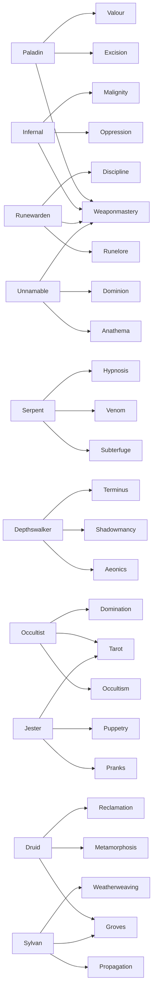
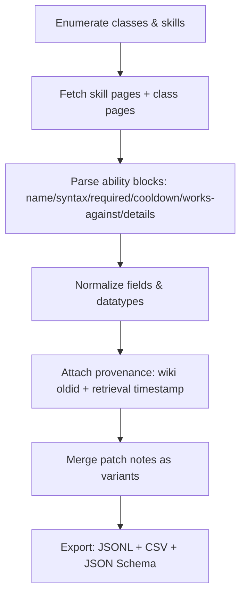

# A Machine-Readable Database of Achaea Class Commands and Attacks

## Executive summary

This report specifies a rigorous approach to extracting *playable-class* commands and attacks from the Achaea Wiki into a clean, machine-readable database suitable for AI ingestion, and it provides a normalized data model (JSON Schema), example JSON records for three representative classes, and a CSV-ready table layout with sample rows. citeturn1view0turn19view0turn12view0

Key findings relevant to building a trustworthy database:

Achaea currently advertises **21 playable classes**, and the Achaea Wiki’s Category:Classes page likewise enumerates **21 classes** with their associated skill triads. citeturn2view0turn1view0turn19view0

The “class → skills” mapping is *not perfectly stable over time* across official sources: some help-file indexes carry legacy skill listings (e.g., showing “Chivalry/Devotion” where other official listings and the wiki show updated skill triads). A machine-readable database should therefore store **source provenance and “variant/patch” notes rather than overwriting conflicting data**. citeturn3view0turn19view0turn18view0

The Achaea Wiki skill pages are semi-structured and, in many cases, list abilities with fields like **Syntax**, **Required**, **Works against**, and **Cooldown**—which is ideal for database extraction—yet many pages also contain template placeholders like `{{{channels}}}` / `{{{attacks}}}` that should be treated as explicitly missing. citeturn16view0turn23view0turn17view0

For automation, the Achaea Wiki is powered by **MediaWiki** and exposes a documented **Action API endpoint** at `…/mediawiki/api.php`, enabling reliable programmatic retrieval of page content and revisions. citeturn12view0

For parameter volatility, official patch notes (e.g., “Classleads” posts) contain ongoing adjustments to equilibrium timings, cooldowns, and mechanics—so the database should capture **patch-note deltas** and attach them to affected commands. citeturn18view0

image_group{"layout":"carousel","aspect_ratio":"16:9","query":["Achaea Dreams of Divine Lands classes artwork","Achaea Paladin class art","Achaea Serpent class art","Achaea Depthswalker class art"],"num_per_query":1}

## Class inventory and source-of-truth decisions

### Playable classes

The Achaea Wiki class category explicitly states: “The following are the **21 classes available to adventurers**,” and it lists them by name. citeturn1view0  
The official Achaea classes page likewise states “With **21** … classes to choose from,” and enumerates the same set. citeturn2view0  
The official in-game help mirror “A LIST OF CLASSES” also lists these 21 classes along with their skill packages. citeturn19view0

**Canonical playable class list (21):** Alchemist, Apostate, Bard, Blademaster, Depthswalker, Druid, Infernal, Jester, Magi, Monk, Occultist, Paladin, Pariah, Priest, Psion, Runewarden, Sentinel, Serpent, Shaman, Sylvan, Unnamable. citeturn1view0turn19view0turn2view0

### Notes on “unspecified,” non-playable, or retired items

The Achaea Wiki Category:Classes also contains pages like “Auto-class,” “Outcast,” and group pages like “Knights/Warriors,” which are **not additional playable classes** (they are system/grouping pages). citeturn1view0turn15search15turn22search2

While the playable class list is stable at 21, **skills (and thus commands)** have historically been replaced. For example, the retired Bard skill **Swashbuckling** is documented as having existed until **949 AF**, when it was replaced by a newer skillset. citeturn4search5  
Similarly, the retired class skill **Forging** is documented as replaced/split with the advent of tradeskills and the introduction of **Weaponmastery**, and this change is corroborated by an official 2015 announcement stating that knight classes had Forging replaced by Weaponmastery. citeturn22search14turn24view0

### Class-to-skill mapping used for command extraction

For “current” playable-class command extraction, the class-to-skill mapping should be taken from the Achaea Wiki Category:Classes table and cross-checked with the “A LIST OF CLASSES” help file. citeturn1view0turn19view0  
Example: the help file explicitly notes that **Woe is exclusive to citizens of Cyrene**, while non-Cyrenian Bards use Sagas—this is a class-skill variation that should be encoded in the database rather than flattened. citeturn19view0

To model shared-skill relationships (important for deduplication and cross-class reuse), the Weaponmastery skill page states it is shared by the four knight classes: Infernal, Paladin, Runewarden, and Unnamable. citeturn23view0



## Methodology for extraction, normalization, and provenance

### Source hierarchy and conflict policy

A robust class-command database should be built with explicit precedence:

Primary: Achaea Wiki **skill pages** (each skill page lists “Abilities in <Skill>” with structured fields like Syntax/Required/Works against/Cooldown). citeturn23view0turn16view0turn25view0turn26view0turn27view0turn17view0

Secondary: official “in-game help mirror” pages for command discovery and verification (e.g., “AB <skillname>” and class skill lists). citeturn20view0turn19view0

Change-control: official patch notes and announcements to attach timing/cooldown/mechanics deltas to commands (e.g., Classleads 2025 entries changing equilibrium baselines or specific cooldowns). citeturn18view0turn24view0

Conflict policy: never overwrite; instead, store a **variant set**: `(field_name, value, source_url, source_date/revision, confidence)` and mark a “current_best_guess” per deployment profile (e.g., “as-of 2026-03-06”). The need for this is evidenced by discrepancies among official help structures. citeturn3view0turn19view0turn18view0

### Automated retrieval via MediaWiki API

The Achaea Wiki runs MediaWiki and explicitly lists an Action API entry point at `…/mediawiki/api.php`. citeturn12view0  
This enables deterministic retrieval of page content and revisions (critical for provenance and reproducibility).

Recommended extraction workflow:



Achaea’s own help documentation indicates that players can list skills and abilities using in-game commands like `SKILLS` and `AB <skillname>`, which informs a cross-validation strategy: wiki extraction results can be reconciled by comparing against the official help mirror (and optionally in-game AB output logs if you capture them). citeturn20view0

### Parsing rules and normalization heuristics

Achaea Wiki skill pages often present abilities in a repeated field pattern. Example patterns include:

Syntax frequently includes:
- `<target>` / `<dir>` angle-bracket required parameters,
- `[BOOST]`, `[ON|OFF]`, and `[venom1 venom2]` as optional/choice parameters,
- slash aliases like `DOUBLESTAB/DSTAB`. citeturn25view0turn16view0turn27view0

Cooldown fields often express:
- “X seconds of balance,” “X seconds of equilibrium,”
- “Balance cost varies based on weapon speed,”
- multi-phase cooldowns (“Hide: … / Emerge: …”),
- “N second cooldown” in addition to equilibrium time. citeturn16view0turn23view0turn26view0

Resource costs often appear in “Required”:
- mana integers,
- percent resources like “% Holy Wrath” or “% karma,”
- ongoing drains (“mana drain,” “endurance drain”), and
- non-standard resources like “age.” citeturn13search0turn17view0turn25view0turn16view0

Command-type classification (attack/buff/debuff/utility/passive/etc.) is not consistently labeled as a field, so it should be inferred using conservative heuristics:
- If it “gives an affliction” or explicitly hinders, tag as `debuff`.
- If it “grants damage resistance” or raises stats, tag as `buff`/`defense`.
- If it explicitly “deals damage,” tag as `attack` (and note damage type if stated).
- If Syntax is “None” and the text says passive, tag as `passive`.
All such tags should include a `classification_confidence` score and a traceable “why” text span ID (or at least a short rationale string). citeturn23view0turn25view0turn26view0

## Data model for AI ingestion

### Normalized field names and datatypes

To make the database “AI-ingestable,” the critical design choices are:
- stable IDs,
- typed numeric fields,
- explicit nullability for missing wiki fields,
- per-field provenance and patch variants,
- separation of **syntax (canonical text)** from **parameter schema (structured)**.

Recommended normalized columns/JSON keys (core):

- `record_id` (string): stable unique key (`"<class>:<skill>:<command>"` slugged)
- `class_name` (string, enum of 21)
- `skill_name` (string)
- `command_name` (string)
- `syntax_variants` (array of strings; each string preserved exactly)
- `aliases` (array of strings)
- `parameters` (array of objects)
- `command_tags` (array of enums: `attack`, `buff`, `debuff`, `utility`, `movement`, `defense`, `summon`, `crafting`, `information`, `toggle`, `passive`, `channel`, `other`)
- `resource_cost` (object with typed numeric fields + “drain” booleans)
- `cooldown` (object with `balance_s`, `equilibrium_s`, `other_cooldowns`, and `cooldown_text` fallback)
- `targeting` (object: `target_scope`, `works_against`, `range_notes`)
- `effects` (object: structured where possible + `effects_text` fallback)
- `prerequisites` (object: `requires_weapons`, `requires_state`, `requires_other`)
- `variants` (array of objects capturing conflicting values across sources/patch notes)
- `provenance` (object: `primary_source_url`, `wiki_oldid` if relevant, `retrieved_at`, `source_priority`)
- `data_quality` (object: `missing_fields`, `completeness_score`, `confidence_score`)

### JSON Schema

The schema below is designed to support:
- nulls for missing wiki attributes,
- “variable cooldown” free-text fallbacks,
- patch-note variants, and
- minimal constraints needed for stable ingestion pipelines.

```json
{
  "$schema": "https://json-schema.org/draft/2020-12/schema",
  "$id": "https://example.local/achaea/class-commands.schema.json",
  "title": "Achaea Class Command/Attack Record",
  "type": "object",
  "required": [
    "record_id",
    "class_name",
    "skill_name",
    "command_name",
    "syntax_variants",
    "command_tags",
    "provenance",
    "data_quality"
  ],
  "additionalProperties": false,
  "properties": {
    "record_id": {
      "type": "string",
      "description": "Stable unique identifier, e.g. 'paladin:excision:denounce'."
    },
    "class_name": {
      "type": "string",
      "enum": [
        "Alchemist",
        "Apostate",
        "Bard",
        "Blademaster",
        "Depthswalker",
        "Druid",
        "Infernal",
        "Jester",
        "Magi",
        "Monk",
        "Occultist",
        "Paladin",
        "Pariah",
        "Priest",
        "Psion",
        "Runewarden",
        "Sentinel",
        "Serpent",
        "Shaman",
        "Sylvan",
        "Unnamable"
      ]
    },
    "skill_name": { "type": "string" },
    "command_name": { "type": "string" },
    "aliases": {
      "type": "array",
      "items": { "type": "string" },
      "default": []
    },
    "syntax_variants": {
      "type": "array",
      "minItems": 1,
      "items": { "type": "string" },
      "description": "Exact syntax lines, preserving angle brackets and optional segments."
    },
    "parameters": {
      "type": "array",
      "default": [],
      "items": {
        "type": "object",
        "required": ["name", "optional", "raw_token"],
        "additionalProperties": false,
        "properties": {
          "name": { "type": "string" },
          "raw_token": {
            "type": "string",
            "description": "Literal token from syntax, e.g. '<target>' or '[BOOST]' or 'LEFT|RIGHT'."
          },
          "optional": { "type": "boolean" },
          "param_type": {
            "type": "string",
            "enum": ["string", "integer", "enum", "direction", "item_ref", "target_ref", "free_text", "unknown"],
            "default": "unknown"
          },
          "allowed_values": {
            "type": "array",
            "items": { "type": "string" },
            "default": []
          },
          "notes": { "type": "string", "default": "" }
        }
      }
    },
    "command_tags": {
      "type": "array",
      "minItems": 1,
      "items": {
        "type": "string",
        "enum": [
          "attack",
          "buff",
          "debuff",
          "utility",
          "movement",
          "defense",
          "summon",
          "crafting",
          "information",
          "toggle",
          "passive",
          "channel",
          "other"
        ]
      }
    },
    "resource_cost": {
      "type": "object",
      "additionalProperties": false,
      "default": {},
      "properties": {
        "mana": { "type": ["integer", "null"], "minimum": 0 },
        "endurance": { "type": ["integer", "null"], "minimum": 0 },
        "willpower": { "type": ["integer", "null"], "minimum": 0 },
        "rage": { "type": ["integer", "null"], "minimum": 0 },
        "age": { "type": ["integer", "null"], "minimum": 0 },
        "holy_wrath_pct": { "type": ["number", "null"], "minimum": 0, "maximum": 100 },
        "karma_pct": { "type": ["number", "null"], "minimum": 0, "maximum": 100 },
        "life_essence_pct": { "type": ["number", "null"], "minimum": 0, "maximum": 100 },
        "mana_drain": { "type": "boolean", "default": false },
        "endurance_drain": { "type": "boolean", "default": false },
        "other_cost_text": { "type": "string", "default": "" }
      }
    },
    "cooldown": {
      "type": "object",
      "additionalProperties": false,
      "default": {},
      "properties": {
        "balance_s": { "type": ["number", "null"], "minimum": 0 },
        "equilibrium_s": { "type": ["number", "null"], "minimum": 0 },
        "wrath_balance_s": { "type": ["number", "null"], "minimum": 0 },
        "fixed_cooldown_s": { "type": ["number", "null"], "minimum": 0 },
        "cooldown_text": { "type": "string", "default": "" }
      }
    },
    "targeting": {
      "type": "object",
      "additionalProperties": false,
      "default": {},
      "properties": {
        "target_scope": {
          "type": "string",
          "enum": ["self", "single_target", "room_aoe", "directional", "item", "group", "unknown"],
          "default": "unknown"
        },
        "works_against": {
          "type": "array",
          "items": { "type": "string" },
          "default": []
        },
        "range_notes": { "type": "string", "default": "" }
      }
    },
    "effects": {
      "type": "object",
      "additionalProperties": false,
      "default": {},
      "properties": {
        "damage": {
          "type": "object",
          "additionalProperties": false,
          "default": {},
          "properties": {
            "does_damage": { "type": "boolean", "default": false },
            "damage_type": { "type": "string", "default": "" },
            "damage_element": { "type": "string", "default": "" },
            "scaling_formula": { "type": "string", "default": "" },
            "notes": { "type": "string", "default": "" }
          }
        },
        "afflictions_inflicted": {
          "type": "array",
          "default": [],
          "items": {
            "type": "object",
            "required": ["name"],
            "additionalProperties": false,
            "properties": {
              "name": { "type": "string" },
              "duration_s": { "type": ["number", "null"], "minimum": 0 },
              "notes": { "type": "string", "default": "" }
            }
          }
        },
        "defences_removed": {
          "type": "array",
          "items": { "type": "string" },
          "default": []
        },
        "effects_text": { "type": "string", "default": "" }
      }
    },
    "prerequisites": {
      "type": "object",
      "additionalProperties": false,
      "default": {},
      "properties": {
        "requires_weapons": { "type": "array", "items": { "type": "string" }, "default": [] },
        "requires_state": { "type": "array", "items": { "type": "string" }, "default": [] },
        "requires_other": { "type": "array", "items": { "type": "string" }, "default": [] }
      }
    },
    "variants": {
      "type": "array",
      "default": [],
      "items": {
        "type": "object",
        "required": ["field", "value", "source_url"],
        "additionalProperties": false,
        "properties": {
          "field": { "type": "string" },
          "value": {},
          "source_url": { "type": "string" },
          "source_date": { "type": "string", "default": "" },
          "notes": { "type": "string", "default": "" }
        }
      }
    },
    "provenance": {
      "type": "object",
      "required": ["primary_source_url", "retrieved_at", "source_priority"],
      "additionalProperties": false,
      "properties": {
        "primary_source_url": { "type": "string" },
        "wiki_oldid": { "type": ["integer", "null"] },
        "retrieved_at": { "type": "string", "description": "ISO 8601 timestamp." },
        "source_priority": { "type": "string", "enum": ["primary_wiki", "secondary_help", "patch_note", "other"] }
      }
    },
    "data_quality": {
      "type": "object",
      "required": ["missing_fields", "completeness_score", "confidence_score"],
      "additionalProperties": false,
      "properties": {
        "missing_fields": { "type": "array", "items": { "type": "string" } },
        "completeness_score": { "type": "number", "minimum": 0, "maximum": 1 },
        "confidence_score": { "type": "number", "minimum": 0, "maximum": 1 },
        "notes": { "type": "string", "default": "" }
      }
    }
  }
}
```

## Worked examples for three classes

The user request asks for per-class command tables with full mechanics fields. A fully exhaustive “all classes × all commands” listing is extremely large (thousands of rows once every skill ability is expanded). The examples below demonstrate the intended rigor and encoding strategy using three classes that cover diverse resource systems and syntax patterns: Paladin (Holy Wrath), Depthswalker (Age/Boost), and Serpent (Venoms + Hypnosis). The same schema and parsing rules generalize to the remaining classes because the wiki skill pages follow similar “Abilities in <Skill>” layouts. citeturn13search0turn25view0turn16view0turn23view0turn27view0turn26view0turn1view0

### Paladin (Weaponmastery, Excision, Valour)

Paladin skill composition is explicitly documented by both the wiki and the in-game help list. citeturn22search9turn19view0turn23view0turn13search0turn13search1

| Command/attack | Exact syntax (incl. aliases/params) | Command type | Resource costs | Cooldowns / recast | Target type | Effects & mechanics | Prerequisites | Variations across sources/patches |
|---|---|---|---|---|---|---|---|---|
| Denounce | `PERFORM DENOUNCE <target>` | debuff / utility | `holy_wrath_pct=20` | `wrath_balance_s=4.0` | single_target | Strips rebounding; if target is burning, also strips prismatic barrier; wrath cost reduced if target is ablaze. citeturn13search0 | target required; “ablaze” conditional behavior | Treat “prismatic barrier” interaction as conditional; duration/edge cases not specified → encode as notes. citeturn13search0 |
| Bladefire | `PERFORM BLADEFIRE` | buff / attack_enabler | `holy_wrath_pct=10` | `wrath_balance_s=3.0` | self | Buffs weapon strikes for ~20s or 3 strikes: on hit, sets target ablaze or increases burning. citeturn13search0 | requires weapon strikes afterward | Burning formula not provided; store as `effects_text` and mark `scaling_formula=null`. citeturn13search0 |
| Faith | `PERFORM FAITH` | defense / buff | (not specified in field) | `equilibrium_s=3.2` | self | Grants resistance to cutting, blunt, and magic (less for magic). citeturn13search0 | none stated | Numeric resist values omitted → mark unknown. citeturn13search0 |
| Confront | `PERFORM CONFRONT <target>` | attack | (not specified in field) | `equilibrium_s=3.6` | single_target | Deals magical fire damage; bypasses—but does not strip—magical shields; additional mana-loss if target ablaze; unblockable if target is ablaze (per wiki details). citeturn13search0 | target required | Distinguish “bypass vs strip” as separate effect fields. citeturn13search0 |
| Battlecry | `BATTLECRY <target>` | debuff / utility | (not specified) | `equilibrium_s=4.0` | single_target | Stuns and knocks prone if target is not deaf. citeturn13search1 | target not deaf | Affliction duration not specified → unknown. citeturn13search1 |
| Rage | `RAGE` | utility / cleanse | `mana=150` | (not specified on Valour page) | self | Historically cures pacifying afflictions. citeturn13search1 | none stated | Patch notes describe a rework: no longer restricted in what it can cure; affliction reapplies after ~3.5s; cooldown increased. Encode as `variants[]`. citeturn18view0turn13search1 |
| Arc | `ARC [<venom>]` ; `ARC <target> [<venom>]` | attack / room_aoe | (not specified) | `balance_s=4.75` (room); `balance_s=3.0` (single-target note) | room_aoe OR single_target | Room arc hits everyone; optional target makes it strike only that person and recovers faster; can be used off equilibrium. citeturn23view0 | Weaponmastery; requires sword usage context | Store both cooldown values as variants keyed by syntax form. citeturn23view0 |

### Depthswalker (Aeonics, Shadowmancy, Terminus)

Depthswalker skill composition is listed in the wiki class inventory and in-game help list. citeturn1view0turn19view0turn25view0  
Aeonics is explicitly categorized as needing edits, which affects confidence and completeness scoring. citeturn25view0

| Command/attack | Exact syntax (incl. aliases/params) | Command type | Resource costs | Cooldowns / recast | Target type | Effects & mechanics | Prerequisites | Variations across sources/patches |
|---|---|---|---|---|---|---|---|---|
| Divine | `CHRONO DIVINE <target> [BOOST]` | information / utility | `age=40` | (not stated) | single_target | Locates an adventurer; when boosted, costs no balance or equilibrium. citeturn25view0 | target required; BOOST optional | Exact base recovery time is missing on the page → encode nulls + notes. citeturn25view0 |
| Aeon | `CHRONO AEON <target> [BOOST]` | debuff | `age=360` | (not stated) | single_target | Applies aeon curse if target lacks speed; otherwise strips speed defense; boosted version persists until cured. citeturn25view0 | target required; speed-defense conditional | Duration without boost is unspecified (“fade after a while”) → unknown. citeturn25view0 |
| Displace | `CHRONO DISPLACE <dir> [BOOST]` | movement | `age=200` | (not stated) | directional/self | Shifts to adjacent location; boosted reduces equilibrium cost (amount not specified). citeturn25view0 | direction required | Encode “reduced equilibrium cost” as non-numeric text unless help/patch provides numeric. citeturn25view0 |
| Distort | `CHRONO DISTORT [BOOST]` | room control / debuff | `age=300` | (not stated) | room_aoe | Distorts room time to hinder enemy escape; boosted removes eq cost; potency decreases with age. citeturn25view0 | affects “personal enemies” concept | Patch notes: “DISTORTION” (Aeonics) was adjusted to match other room hinders (balance knock normalization). Store as variant note. citeturn18view0turn25view0 |
| Doom | `CHRONO DOOM <target> [BOOST]` | attack / execute | `age=720` | (not stated) | single_target | “Eradicate someone from the timestream”; cannot act while preparing; boosted prevents abort by some hindrances and speeds completion; if boosted and fails to complete, backlash kills the user instantly. citeturn25view0 | target required; channel-like concentration; aeon on target speeds completion slightly | Instant-death-on-failure is a critical mechanic → encode `effects.damage.notes`. citeturn25view0 |
| Discard | `CHRONO DISCARD <amount> [BOOST]` | resource conversion | `age=150` | (not stated) | self | Converts health → mana at 50% loss; boosted removes equilibrium cost. citeturn25view0 | requires numeric amount | “50% loss” is an explicit formula; store in `scaling_formula`. citeturn25view0 |

### Serpent (Subterfuge, Venom, Hypnosis)

Serpent skill composition is documented in the wiki class inventory and the in-game help list. citeturn1view0turn19view0turn16view0turn26view0turn27view0

| Command/attack | Exact syntax (incl. aliases/params) | Command type | Resource costs | Cooldowns / recast | Target type | Effects & mechanics | Prerequisites | Variations across sources/patches |
|---|---|---|---|---|---|---|---|---|
| Garrote | `GARROTE <target>` | attack | (not specified) | `balance_s=null` (`cooldown_text="varies by weapon speed"`) | single_target | Uses wielded whip; bypasses armor; always hits if target helpless (paralysed/tied/frozen/prone/sleeping/etc.); scales with Subterfuge. citeturn16view0 | requires whip; target helpless boosts hit certainty | Scaling formula not specified; store as text. citeturn16view0 |
| Flay | `FLAY <target>`; `FLAY <target> REBOUNDING [<venom>]`; `FLAY <target> SHIELD [<venom>]` | utility / debuff | (not specified) | `balance_s=2.0` | single_target | Removes sileris coating; can strip rebounding aura or magical shield; may apply a venom from whip if it leaves target without rebounding/shield. citeturn16view0 | requires whip; optional venom parameter | Conditional venom application should be an explicit structured rule in `effects_text`. citeturn16view0 |
| Doublestab | `DOUBLESTAB/DSTAB <target> [venom1 venom2]` | attack / debuff | (not specified) | `balance_s=2.8` | single_target | Requires envenomed dirk with >1 venom; delivers two venoms simultaneously. citeturn16view0 | requires wielded/envenomed dirk | Venom list itself is in Venom skill; cross-link by venom name IDs. citeturn16view0turn26view0 |
| WORM SEEK | `WORM SEEK` | information / utility | (not specified) | `equilibrium_s=3.0` | room | Detects wormhole presence and destination in room. citeturn16view0 | none stated | Wormhole behaviors have broader docs; keep as separate concept entity in DB if desired. citeturn15search0turn16view0 |
| WORM WARP | `WORM WARP` | movement | (not specified) | `equilibrium_s=4.0` | room/self | Enters a wormhole if present. citeturn16view0 | requires wormhole present | None. citeturn16view0 |
| Hypnotise (suite) | `HYPNOTISE <target>`; `SUGGEST <target> <suggestion>`; `SEAL <target> <delay in seconds>`; `SNAP <target>` | debuff / control | `other_cost_text="Equilibrium"` | (base not stated) | single_target | Establish trance, implant suggestions, seal with timer; SNAP triggers suggestions in succession. citeturn27view0 | typical: maintain trance; target must be trance-held | Suggestion sets are large; store as separate “sub-abilities” or parameter enum expansion. citeturn27view0 |
| Seal | `SEAL <target> <delay in seconds>` | control / timing | `mana=200` | `equilibrium_s=2.0` | single_target | Sets suggestion interval (every 4s normally); if target has deadened mind, delay can be as low as 1s and ticks every 3s. citeturn27view0 | target must be hypnotised; “deadened mind” conditional | Encode tick interval differences as conditional variants. citeturn27view0 |
| Bite | `BITE <target> [<venom>]` | attack / debuff | (not specified) | `balance_s=4.0` | single_target | Bite; optional venom parameter works for adventurers; venom set includes many named venoms with distinct afflictions. citeturn26view0 | venom must be secreted / available; target is required | Many venom entries omit cooldowns; treat each venom as “payload” record. citeturn26view0 |
| Shrugging | `SHRUGGING` | utility / cleanse | (not specified) | `equilibrium_s=1.6`; `fixed_cooldown_s=10.0` | self | Cures one affliction; has separate post-use cooldown. citeturn26view0 | none stated | Affliction selection algorithm unspecified; record as unknown. citeturn26view0 |

### Example JSON records (three classes)

These examples demonstrate (1) Holy Wrath percent costs, (2) Age + BOOST semantics, and (3) alias parsing for slash syntax.

```json
[
  {
    "record_id": "paladin:excision:denounce",
    "class_name": "Paladin",
    "skill_name": "Excision",
    "command_name": "Denounce",
    "aliases": [],
    "syntax_variants": ["PERFORM DENOUNCE <target>"],
    "parameters": [
      { "name": "target", "raw_token": "<target>", "optional": false, "param_type": "target_ref", "allowed_values": [], "notes": "" }
    ],
    "command_tags": ["debuff", "utility"],
    "resource_cost": {
      "mana": null,
      "endurance": null,
      "willpower": null,
      "rage": null,
      "age": null,
      "holy_wrath_pct": 20,
      "karma_pct": null,
      "life_essence_pct": null,
      "mana_drain": false,
      "endurance_drain": false,
      "other_cost_text": ""
    },
    "cooldown": { "balance_s": null, "equilibrium_s": null, "wrath_balance_s": 4.0, "fixed_cooldown_s": null, "cooldown_text": "" },
    "targeting": { "target_scope": "single_target", "works_against": [], "range_notes": "" },
    "effects": {
      "damage": { "does_damage": false, "damage_type": "", "damage_element": "", "scaling_formula": "", "notes": "" },
      "afflictions_inflicted": [],
      "defences_removed": ["rebounding (conditional)", "prismatic barrier (conditional: if target burning)"],
      "effects_text": "Shatters rebounding if present; if target is burning, also strips prismatic barrier; wrath cost reduced vs ablaze targets."
    },
    "prerequisites": { "requires_weapons": [], "requires_state": [], "requires_other": ["Ability learned in Excision"] },
    "variants": [],
    "provenance": {
      "primary_source_url": "https://wiki.achaea.com/Excision",
      "wiki_oldid": null,
      "retrieved_at": "2026-03-06T00:00:00-05:00",
      "source_priority": "primary_wiki"
    },
    "data_quality": {
      "missing_fields": ["cooldown.balance_s", "cooldown.equilibrium_s", "resource_cost.mana", "targeting.works_against"],
      "completeness_score": 0.72,
      "confidence_score": 0.70,
      "notes": "Core syntax/cost present; numeric resist/duration and explicit target taxonomy not supplied in page field layout."
    }
  },
  {
    "record_id": "depthswalker:aeonics:chrono_aeon",
    "class_name": "Depthswalker",
    "skill_name": "Aeonics",
    "command_name": "Aeon",
    "aliases": [],
    "syntax_variants": ["CHRONO AEON <target> [BOOST]"],
    "parameters": [
      { "name": "target", "raw_token": "<target>", "optional": false, "param_type": "target_ref", "allowed_values": [], "notes": "" },
      { "name": "boost", "raw_token": "[BOOST]", "optional": true, "param_type": "unknown", "allowed_values": [], "notes": "Optional booster; consumes age and changes persistence." }
    ],
    "command_tags": ["debuff"],
    "resource_cost": {
      "mana": null,
      "endurance": null,
      "willpower": null,
      "rage": null,
      "age": 360,
      "holy_wrath_pct": null,
      "karma_pct": null,
      "life_essence_pct": null,
      "mana_drain": false,
      "endurance_drain": false,
      "other_cost_text": ""
    },
    "cooldown": { "balance_s": null, "equilibrium_s": null, "wrath_balance_s": null, "fixed_cooldown_s": null, "cooldown_text": "Not stated on Aeonics page." },
    "targeting": { "target_scope": "single_target", "works_against": ["Adventurers"], "range_notes": "" },
    "effects": {
      "damage": { "does_damage": false, "damage_type": "", "damage_element": "", "scaling_formula": "", "notes": "" },
      "afflictions_inflicted": [{ "name": "Aeon", "duration_s": null, "notes": "If target lacks speed defense; otherwise strips speed." }],
      "defences_removed": ["speed (conditional: if present)"],
      "effects_text": "Applies aeon curse (delays actions) if target lacks speed; if target is protected by speed, strips it. Boost makes curse persist until cured."
    },
    "prerequisites": { "requires_weapons": [], "requires_state": [], "requires_other": ["Ability learned in Aeonics"] },
    "variants": [
      {
        "field": "effects.effects_text",
        "value": "Aeonics Distortion mechanics adjusted in 2025 classleads; Aeon itself not explicitly changed there.",
        "source_url": "https://www.achaea.com/2025/12/09/classleads",
        "source_date": "2025-12-09",
        "notes": "Included to demonstrate patch-note linkage at skill level."
      }
    ],
    "provenance": {
      "primary_source_url": "https://wiki.achaea.com/Aeonics",
      "wiki_oldid": 47249,
      "retrieved_at": "2026-03-06T00:00:00-05:00",
      "source_priority": "primary_wiki"
    },
    "data_quality": {
      "missing_fields": ["cooldown.balance_s", "cooldown.equilibrium_s"],
      "completeness_score": 0.68,
      "confidence_score": 0.63,
      "notes": "Syntax and cost are explicit; recovery timings often omitted; page is tagged 'Edit needed' on the wiki."
    }
  },
  {
    "record_id": "serpent:subterfuge:doublestab",
    "class_name": "Serpent",
    "skill_name": "Subterfuge",
    "command_name": "Doublestab",
    "aliases": ["DSTAB"],
    "syntax_variants": ["DOUBLESTAB/DSTAB <target> [venom1 venom2]"],
    "parameters": [
      { "name": "target", "raw_token": "<target>", "optional": false, "param_type": "target_ref", "allowed_values": [], "notes": "" },
      { "name": "venom1", "raw_token": "[venom1", "optional": true, "param_type": "string", "allowed_values": [], "notes": "Optional venom payload from envenomed dirk stack." },
      { "name": "venom2", "raw_token": "venom2]", "optional": true, "param_type": "string", "allowed_values": [], "notes": "Optional venom payload from envenomed dirk stack." }
    ],
    "command_tags": ["attack", "debuff"],
    "resource_cost": {
      "mana": null,
      "endurance": null,
      "willpower": null,
      "rage": null,
      "age": null,
      "holy_wrath_pct": null,
      "karma_pct": null,
      "life_essence_pct": null,
      "mana_drain": false,
      "endurance_drain": false,
      "other_cost_text": ""
    },
    "cooldown": { "balance_s": 2.8, "equilibrium_s": null, "wrath_balance_s": null, "fixed_cooldown_s": null, "cooldown_text": "" },
    "targeting": { "target_scope": "single_target", "works_against": ["Adventurers"], "range_notes": "" },
    "effects": {
      "damage": { "does_damage": false, "damage_type": "", "damage_element": "", "scaling_formula": "", "notes": "Primary effect is venom delivery." },
      "afflictions_inflicted": [],
      "defences_removed": [],
      "effects_text": "If wielding a dirk envenomed with multiple venoms, delivers two venoms to target simultaneously."
    },
    "prerequisites": { "requires_weapons": ["dirk (envenomed with >1 venom)"], "requires_state": [], "requires_other": ["Ability learned in Subterfuge"] },
    "variants": [],
    "provenance": {
      "primary_source_url": "https://wiki.achaea.com/mediawiki/index.php?title=Subterfuge",
      "wiki_oldid": 46980,
      "retrieved_at": "2026-03-06T00:00:00-05:00",
      "source_priority": "primary_wiki"
    },
    "data_quality": {
      "missing_fields": ["resource_cost.mana", "cooldown.equilibrium_s"],
      "completeness_score": 0.74,
      "confidence_score": 0.70,
      "notes": "Syntax/alias/cooldown present; venom payload semantics depend on Venom skill dataset."
    }
  }
]
```

### CSV-ready table (schema + sample rows)

This is a CSV-friendly flat representation. Arrays/objects are JSON-encoded strings for round-tripping.

```csv
record_id,class_name,skill_name,command_name,aliases,syntax_variants,command_tags,resource_cost_json,cooldown_json,targeting_json,effects_json,prerequisites_json,provenance_json,missing_fields,completeness_score,confidence_score
paladin:excision:denounce,Paladin,Excision,Denounce,"[]","[""PERFORM DENOUNCE <target>""]","[""debuff"",""utility""]","{""holy_wrath_pct"":20}","{""wrath_balance_s"":4.0}","{""target_scope"":""single_target""}","{""defences_removed"":[""rebounding (conditional)"",""prismatic barrier (conditional)""]}","{""requires_other"":[""Ability learned in Excision""]}","{""primary_source_url"":""https://wiki.achaea.com/Excision""}","[""cooldown.balance_s"",""cooldown.equilibrium_s""]",0.72,0.70
depthswalker:aeonics:chrono_aeon,Depthswalker,Aeonics,Aeon,"[]","[""CHRONO AEON <target> [BOOST]""]","[""debuff""]","{""age"":360}","{""cooldown_text"":""Not stated on Aeonics page.""}","{""target_scope"":""single_target"",""works_against"":[""Adventurers""]}","{""afflictions_inflicted"":[""Aeon""],""defences_removed"":[""speed (conditional)""]}","{""requires_other"":[""Ability learned in Aeonics""]}","{""primary_source_url"":""https://wiki.achaea.com/Aeonics"",""wiki_oldid"":47249}","[""cooldown.balance_s"",""cooldown.equilibrium_s""]",0.68,0.63
serpent:subterfuge:doublestab,Serpent,Subterfuge,Doublestab,"[""DSTAB""]","[""DOUBLESTAB/DSTAB <target> [venom1 venom2]""]","[""attack"",""debuff""]","{}","{""balance_s"":2.8}","{""target_scope"":""single_target"",""works_against"":[""Adventurers""]}","{""effects_text"":""Delivers two venoms if dirk is multi-envenomed.""}","{""requires_weapons"":[""dirk (envenomed with >1 venom)""]}","{""primary_source_url"":""https://wiki.achaea.com/mediawiki/index.php?title=Subterfuge"",""wiki_oldid"":46980}","[""resource_cost.mana""]",0.74,0.70
```

## Completeness and confidence assessment by class

### What “completeness” means here

Because the wiki often provides **Syntax** and **Works against**, but sometimes omits **Required** or precise cooldowns (or replaces them with “varies by weapon speed”), completeness must be computed per field family:

Syntax completeness is generally high because syntax lines are present for many abilities across core combat skills (e.g., Weaponmastery, Subterfuge, Aeonics). citeturn23view0turn16view0turn25view0

Cost/cooldown completeness is mixed: some pages give explicit numbers (e.g., Subterfuge Flay; Hypnosis Seal), others omit or specify variability (e.g., Garrote, many suggestion entries). citeturn16view0turn27view0turn26view0

Mechanics/formula completeness is often medium-to-low because many effects are described qualitatively (“scales with Subterfuge,” “fade after a while”) without explicit formulas. citeturn16view0turn25view0turn13search0

### Per-class estimates (heuristic, as-of 2026-03-06)

The table below estimates how well the required fields can be populated *from the wiki + official help + patch notes*, using observed patterns in representative skill pages and the fact that each class maps to three skill pages in the class inventories. citeturn1view0turn19view0turn18view0turn23view0turn16view0turn25view0

| Class | Status | Skills (current package) | Estimated completeness | Confidence | Rationale (what tends to be missing/volatile) |
|---|---|---|---:|---:|---|
| Alchemist | active | Alchemy, Physiology, Formulation/Sublimation | 0.65 | 0.60 | Costs/cooldowns and mechanics often subject to patch tuning; requires strong provenance/variants. citeturn19view0turn18view0turn24view0 |
| Apostate | active | Evileye, Necromancy, Apostasy | 0.65 | 0.60 | Patch notes show equilibrium baseline changes for abilities like STRIP (illustrating volatility). citeturn18view0turn19view0 |
| Bard | active (city-variant skill) | Bladedance, Composition, Sagas/Woe | 0.70 | 0.62 | Explicit class-skill branching (Woe exclusive to Cyrene) increases modeling complexity. citeturn19view0turn18view0 |
| Blademaster | active | TwoArts, Striking, Shindo | 0.65 | 0.60 | Limb/weapon mechanics frequently patched; syntax usually clear. citeturn18view0turn1view0 |
| Depthswalker | active | Aeonics, Shadowmancy, Terminus | 0.63 | 0.58 | Aeonics page tagged “Edit needed” and omits many cooldown timings; BOOST mechanics require conditional encoding. citeturn25view0turn18view0turn1view0 |
| Druid | active | Groves, Metamorphosis, Reclamation | 0.67 | 0.60 | Groves and Reclamation have patch-note variability; mechanics often conditional. citeturn18view0turn1view0 |
| Infernal | active | Weaponmastery, Oppression, Malignity | 0.70 | 0.63 | Weaponmastery is well-structured; class-specific skills have complex resource systems (e.g., life essence). citeturn23view0turn21search1turn22search17turn19view0 |
| Jester | active | Tarot, Pranks, Puppetry | 0.66 | 0.60 | Some skill pages include long lists with partial cooldown/cost fields; requires careful parsing. citeturn14search1turn1view0 |
| Magi | active | Elementalism, Crystalism, Artificing | 0.66 | 0.60 | Historical replacements (Enchanting→Artificing) demonstrate need for retired-skill support. citeturn24view0turn1view0 |
| Monk | active | Tekura/Shikudo, Kaido, Telepathy | 0.67 | 0.61 | Telepathy shows structured required/cooldown; some mechanics are conditional and patch-tuned. citeturn14search3turn18view0turn1view0 |
| Occultist | active | Occultism, Tarot, Domination | 0.68 | 0.61 | Occultism shows structured mana/karma costs; Tarot is extensive; some template placeholders present. citeturn17view0turn14search1turn1view0 |
| Paladin | active | Weaponmastery, Excision, Valour | 0.75 | 0.70 | Excision/Valour provide many explicit cooldowns and costs; patch notes still affect shared “warrior” abilities. citeturn13search0turn13search1turn23view0turn18view0turn19view0 |
| Pariah | active | Memorium, Pestilence, Charnel | 0.64 | 0.58 | More specialized mechanics; likely more qualitative descriptions; patch notes affect class subsystems. citeturn18view0turn1view0 |
| Priest | active | Spirituality, Devotion, Zeal | 0.66 | 0.60 | Patch notes show baseline changes (e.g., STRIP) and situational speedups (e.g., SAP vs prone). citeturn18view0turn19view0 |
| Psion | active | Weaving, Psionics, Emulation | 0.65 | 0.58 | Patch notes show ability blocking conditions changed (e.g., EXPUNGE blocked by mangled head/confusion). citeturn18view0turn19view0 |
| Runewarden | active | Weaponmastery, Runelore, Discipline | 0.70 | 0.64 | Runelore entries are structured (syntax/inks/cooldowns); patch notes still modify rune behaviors. citeturn21search0turn18view0turn19view0turn23view0 |
| Sentinel | active | Metamorphosis, Woodlore, Skirmishing | 0.65 | 0.59 | Shared Metamorphosis + environment-dependent abilities increase conditionality. citeturn1view0turn19view0 |
| Serpent | active | Subterfuge, Venom, Hypnosis | 0.72 | 0.66 | Subterfuge and Venom are richly enumerated; some cooldowns/costs are variable or missing, and payload space (venoms/suggestions) must be modeled as expandable enums. citeturn16view0turn26view0turn27view0turn1view0 |
| Shaman | active | Spiritlore, Curses, Vodun | 0.64 | 0.58 | Many systems and conditionals likely; patch notes affect interactions and timing. citeturn18view0turn1view0 |
| Sylvan | active | Propagation, Groves, Weatherweaving | 0.66 | 0.60 | Shared Groves + elemental/ranged behavior touched by patch notes (e.g., lightning interactions). citeturn18view0turn1view0 |
| Unnamable | active | Weaponmastery, Anathema, Dominion | 0.68 | 0.62 | Weaponmastery is structured; class-specific skills involve complex subsystems and patch drift. citeturn23view0turn22search18turn1view0 |

## Source list and unresolved ambiguities

### Source list with URLs

The citations throughout the report link to the sources. Below is a URL list (as requested) for direct access and for use in automated scraping.

```text
Achaea Wiki - Category:Classes
https://wiki.achaea.com/Category:Classes

Achaea official - Classes page
https://www.achaea.com/classes

Achaea official help - A LIST OF CLASSES
https://www.achaea.com/game-help?what=a-list-of-classes.

Achaea official help - A list of basic commands (AB <skillname>)
https://www.achaea.com/game-help?what=a-list-of-basic-commands

Achaea official patch notes - Classleads (Dec 9, 2025)
https://www.achaea.com/2025/12/09/classleads

Achaea official announcement - “A new year, a new day for Achaea” (Jan 1, 2015)
https://www.achaea.com/news/announce/4245

Achaea Wiki - Special:Version (API endpoint discovery)
https://wiki.achaea.com/Special:Version

Achaea Wiki - Weaponmastery
https://wiki.achaea.com/mediawiki/index.php?title=Weaponmastery

Achaea Wiki - Excision
https://wiki.achaea.com/Excision

Achaea Wiki - Valour
https://wiki.achaea.com/Valour

Achaea Wiki - Aeonics
https://wiki.achaea.com/Aeonics

Achaea Wiki - Subterfuge
https://wiki.achaea.com/mediawiki/index.php?title=Subterfuge

Achaea Wiki - Venom (Skill)
https://wiki.achaea.com/Venom_(Skill)

Achaea Wiki - Hypnosis
https://wiki.achaea.com/Hypnosis

Achaea Wiki - Occultism
https://wiki.achaea.com/Occultism

Achaea Wiki - Tarot
https://wiki.achaea.com/Tarot

Achaea Wiki - Swashbuckling (retired Bard skill)
https://wiki.achaea.com/Swashbuckling

Achaea Wiki - Forging (retired knight skill)
https://wiki.achaea.com/Forging
```

### Unresolved ambiguities and how the database should represent them

Template placeholders on many skill pages (e.g., `{{{channels}}}`, `{{{attacks}}}`, `{{{note}}}`) indicate *missing structured fields in the rendered template*, not “empty” game values. These should be represented as explicit `null` fields and surfaced in `data_quality.missing_fields`. citeturn16view0turn23view0turn17view0

Variable recovery times like “Balance cost varies based on weapon speed” cannot be reduced to a single numeric without additional weapon-speed metadata. The database should store `cooldown_text` and a `balance_s=null`, optionally with a future extension field for weapon-speed normalization. citeturn16view0turn23view0

Many mechanics describe scaling without formulas (“damage scales with Subterfuge,” “fade after a while,” “sparingly”). Unless an official help file or patch notes give a formula, store the statement in `effects.effects_text` and leave `scaling_formula` null. citeturn16view0turn25view0turn13search0

Patch-driven changes require time-bounded truth. For example, Classleads entries explicitly alter equilibrium baselines and cooldowns (e.g., “STRIP now base two seconds equilibrium,” “PANTHEON cooldown cut…,” “RAGE rework”), which implies the database must attach **versioned variants** rather than a single timeless value. citeturn18view0

Finally, some official help structures appear to embed older skill triads (e.g., the “Classes and Houses” help index lists “Chivalry/Devotion” combinations), which reinforces the need for temporal provenance and multi-source variants even among “official” sources. citeturn3view0turn19view0